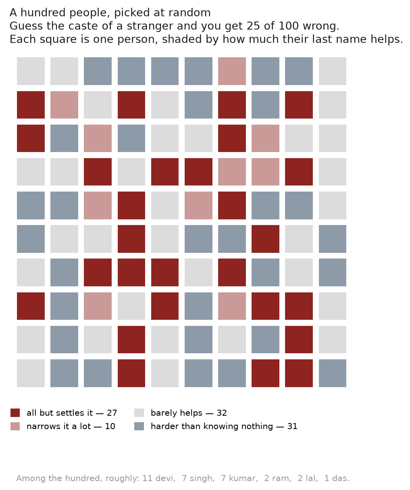

# On a last-name basis

**How much does an Indian last name tell you about caste — and how much of that
is really the name, rather than the place?**

Everything here is measured the same way, in a unit that needs no explaining:
**of a hundred people, how many would you get wrong?**

## Two analyses

### [01 — a surname alone, across India](analyses/01_surname_to_category)

Take a hundred adults at random: about 19 are Dalit, 6 Adivasi, 75 neither.
Guess "neither" every time and you get **25 of 100 wrong**. Now let yourself
hear their last name. You get **20 wrong**.

Five mistakes saved, and that average describes nobody. A few names settle it
outright — Jha and Yadav cost you 0 and 1. But for **91% of people the name does
not change your answer at all**, and for **32% it makes the guess harder**.
Meanwhile the names that would help are carried by almost no one: Devi, Singh
and Kumar are the three commonest surnames in India, and all three leave you no
better off than a stranger would.

[](analyses/01_surname_to_category/note.md)

### [02 — a surname plus a place, in Bihar](analyses/02_jati_by_geography)

So are surnames weak, or did we throw away the place? Bihar's land records let
you put a name and a village together, and the answer is unambiguous. Knowing a
surname **and a village** leaves you wrong **16 times in 100** about which of 141
jatis someone belongs to. Keep the surname, drop the village, and it is **47**.

[](analyses/02_jati_by_geography/note.md)

## The two together

Caste is a local fact. A surname carries a great deal where people know the
village and very little where they do not — which is why the same name reads as
informative in a Bihar village and nearly empty in a city. Analysis 02 measures
what the village is worth; analysis 01 measures what is left once it is gone.

## Run it

```
uv venv .venv
uv pip install --python .venv/bin/python -e '.[dev]'

make all      # both pipelines: tables, figures, notes
make a01      # just the first
make a02      # just the second
make test
make lint
```

Each analysis owns its own pipeline, data loading, figures, note and `out/`.
Shared code is only the scoring measure and the drawing style:

| path | what |
|---|---|
| `src/last_name_basis/scoring.py` | mistakes per hundred; ladder scoring; leave-one-out |
| `src/last_name_basis/style.py` | palette, hundred-square grid, band definitions |
| `analyses/01_surname_to_category/` | outkast SECC, all-India |
| `analyses/02_jati_by_geography/` | naampata ladders, Bihar |

## Data

- [outkast](https://github.com/appeler/outkast) — SECC 2011 surname composition,
  installed from PyPI. The package verifies its table and manifest by SHA-256
  before every lookup, so a clean checkout reproduces these numbers exactly.
- [instate](https://github.com/appeler/instate) — 2017 electoral-roll surname
  counts, used for how common a name is. SECC counts heads of household and so
  undercounts women's surnames badly: Devi is 2.3M there and 45M on the rolls,
  where it is the commonest surname in India.
- [jati](https://github.com/in-rolls/jati) / [land](https://github.com/in-rolls/land)
  — Bihar ladders and the caste dictionary with its religion flag.

## What is deliberately not here

No table ranked by how well a name identifies caste. Everything published is
ranked by name frequency, by geography, or looked up by name. The finding is
that a surname alone is a weak signal; a ranked diagnosticity list would be a
screening tool.

## Limits

- Analysis 01 covers **SC / ST / Other only** — SECC has no OBC category. The
  finer categories exist only in analysis 02, and only for Bihar.
- Analysis 02 is **Bihar, landowners** — it under-represents the landless, who
  are disproportionately Dalit and EBC.
- Both score a perfect guesser with one or two cues. That is a floor on what is
  knowable, not a ceiling on what someone can work out about you: a real person
  also has your first name, your father's or husband's name, your neighbourhood.

MIT licensed.
