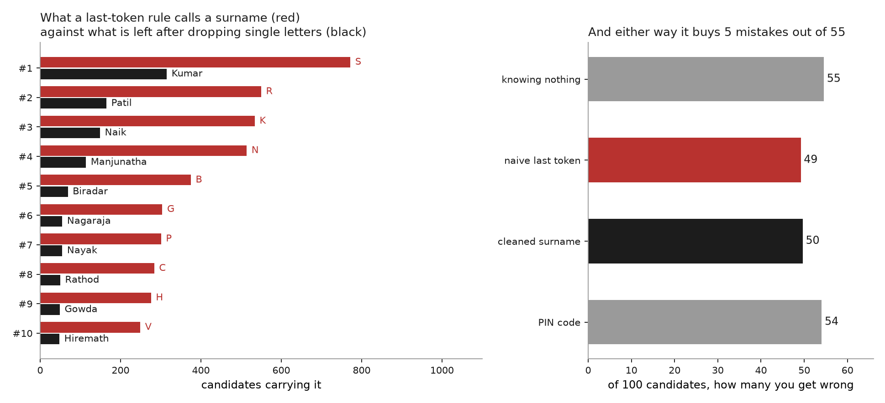

# On a last-name basis

**In a village everyone already knows your caste. In a city a stranger has your
name.**

India is urbanising, and that moves the question of who can identify whom.
Discriminating against someone by caste requires working out their caste first.
In a village that is common knowledge: the settlement, the hamlet, whose son you
are, which lane you live on. A city strips most of that away. What survives on a
rental application or a job form is a name.

So how much does a last name give away? That question sits underneath a lot of
other ones. Anyone acting on caste has to work it out first, and so does anyone
auditing them for it: a study that asks whether Dalits get fewer callbacks
usually infers caste from the applicant's name.

This repo measures only that inference. It does not measure discrimination, it
does not measure urbanisation, and it makes no claim about what happens to
prejudice when people move. It measures what a surname reveals about caste, whom
it reveals least about, and what has to be added to a name before it reveals a
lot.

The operational question: pick an Indian adult at random, know only their last
name, and how often are you wrong about their caste?

**About 20 times in 100.** Knowing nothing at all, you would be wrong 25 times.
The name is worth about five mistakes, and almost all of that comes from a
handful of names hardly anybody carries.

Everything below is measured in that one unit: **of a hundred people, how many
would you get wrong?**

**Two things drive that number besides the name, so no figure here travels
without them.** The first is how fine the question is. Sorting people into
Dalit, Adivasi or neither is a far easier job than placing them among 141 Bihari
jatis, and the same surname leaves 20 mistakes at the first and 47 at the
second. The second is what else the guesser knows. A name plus a village is a
different instrument from a name alone, and a name matched against a caste
register is different again.

So every number below carries its target and its cues. Comparing one to another
across different targets says nothing about surnames; it says the two questions
were not the same question.

## 1. The data, and why it takes several kinds

**No electoral roll in India records caste, and no caste census records who
lives next door to whom.** Neither source answers the question alone, and that
is why this repo triangulates across four kinds of data. Each one supplies
exactly what the others cannot.

| what it gives | what it cannot give | source |
|---|---|---|
| caste composition of a surname, nationally | fine categories; who actually carries the name today | SECC 2011 |
| how common a name is, and who a person's father or husband is | any caste at all | electoral rolls, 2017 |
| jati and hamlet for every household | anywhere outside Bihar; the landless | Bihar land records, Mahadalit census |
| a third population with its own category labels | a population sample of anything | Karnataka PSC lists |

The national picture needs the first two joined. Whether the *place* does the
work the name gets credit for needs the third, because only there can you put a
name and a village together and take the village away. Whether "last name" even
means the same thing across India needs the second and fourth, because that is
where a name can be checked against a relative's name or against an initial.

### Joining caste to frequency

Every national number joins two sources on the surname.

[**outkast**](https://github.com/appeler/outkast) supplies the caste side, from
the 2011 Socio-Economic and Caste Census. For each surname it gives the share of
its bearers who are Scheduled Caste, Scheduled Tribe, or neither. It ships only
cells holding at least 100 records, which leaves **3,930 surnames**.

[**instate**](https://github.com/appeler/instate) supplies the frequency side,
from the 2017 electoral rolls: how many people carry each surname.

The split is deliberate. SECC counts heads of household, who are mostly men, so
it badly undercounts women's surnames: Devi appears 2.3M times in SECC and 45M
times on the rolls, where it is the commonest surname in the country. So how
common a name is comes from the rolls, and what it means comes from SECC.

Filling a room with a hundred people means drawing surnames at their roll
frequency and reading each one's caste mix off SECC. **That room is 19 Dalit, 6
Adivasi, 75 neither.**

**Read every national number here against one limit.** Those 3,930 surnames are
**59% of all the names people carry** on the rolls. The other 41% are the rarer
names, cut by the 100-record floor, and rare names are the informative ones. So
the room is built from the commoner half of Indian naming, which is the half
that reveals least. Every figure below is a floor on what a surname gives away,
not a ceiling.

### The rest

[**Upnaam**](https://github.com/in-rolls/upnaam) resolves which token in a name
is the recorded surname, versioned, for Bihar, Rajasthan and Maharashtra
(analysis 05). `jati`, which is **not a public repository**, and
[**land**](https://github.com/in-rolls/land) hold the Bihar land records and the
Mahadalit census, with a jati and a hamlet for each household (analyses 02 and
06). [**pranaam**](https://github.com/appeler/pranaam) holds the Karnataka
Public Service Commission select lists (analysis 08).

Because analyses 02 and 06 read from a local clone of `jati`, those two cannot
be reproduced from a clean checkout. The other six can.

## 2. The analyses

### [01 The surname alone, across India](analyses/01_surname_to_category)

Guess "neither" for everyone in that room of a hundred and you are wrong **25**
times. Let yourself hear the last name and you are wrong **20**.

The five mistakes you save are not spread around. For **91% of people the
surname does not change the guess at all**. A few names settle it outright, and
Jha and Yadav cost you 0 and 1, but almost nobody carries them. Sort every
surname by how many people have it and the two facts run in opposite directions:

| rank by frequency | names | share of India | how many change your answer |
|---|---|---|---|
| 1–10 | 10 | **32%** | **none** |
| 11–25 | 15 | 13% | 2 |
| 26–50 | 25 | 10% | 8 |
| 1001–3930 | 2,930 | 6% | 625 |

The ten commonest surnames in the country cover a third of everybody and not one
of them moves your guess off the base rate. The names that settle the question
sit in the tail, carried by a few people each.

[](analyses/01_surname_to_category/note.md)

For a further **16% of people** the surname does something subtler and worth
naming. It reveals that they sit in a far more mixed pool than the population
average. `ram` is 45% Dalit and 47% not, close to a coin flip. But the best
guess for someone called Ram is still "neither", and it is still wrong 53 times
in 100, exactly as often as guessing blind. The name tells them to be less
certain without giving them a better answer.

### [02 The surname plus a place, in Bihar](analyses/02_jati_by_geography)

So are surnames weak, or did we throw the place away? Bihar's land records put a
name and a village together, and the answer is not close. A surname **and a
village** leaves you wrong **17 times in 100** about which of 141 jatis someone
belongs to. Keep the surname, drop the village, and it is **47**.

Both are leave-one-out figures. Half those name-and-village cells hold a single
household, so scoring a household against a table it helped build reads 16
instead, and the flattery lands on the one rung this comparison turns on.

[](analyses/02_jati_by_geography/note.md)

### [03 India's commonest last name tells you nothing](analyses/03_how_few_names)

The commonest last name in India is **devi**, at 6.5% of the electoral roll. It
is a real last name, but it records the bearer's sex rather than her family. On
the Bihar rolls **81% of women carry a name from this group against 10% of
men**, and the family names in the same state read as 84 to 89% male, because
those families' women are on the roll as Devi. A woman and her brother do not
share a last name.

That is why these names carry no caste signal: a name assigned by sex cannot
track a lineage. The clear cases cover **10.5% of the country**, and adding
Singh and Kumar takes it to 19%. Counting them makes Indian naming look far more
concentrated than it is. Eighteen names cover a quarter of India, but **103** if
you count only names a brother and sister share.

[](analyses/03_how_few_names/note.md)

### [04 Which token is actually the surname?](analyses/04_which_token_is_the_surname)

The analyses above lean on a list of names I wrote by hand. The rolls can
measure it instead. Every record carries the elector's **father or husband**,
and a token appearing in both names is one that **passed between two family
members**.

The hand list was right about the ten sex-marking names, which all transmit
under 1% of the time, and wrong about the two it called ambiguous. **Singh
transmits 78% of the time and Kumar 8%**, so Singh is mostly a real inherited
surname and Kumar mostly is not. The test also found a category the list never
contemplated: given names sitting in the last-name slot, larger than everything
on it.

And it caught a defect. **Maharashtra writes the surname first**, as in `patil
ashwini` with father `patil ashok`, so instate's last-token column holds a
*given* name there. Analysis 03's Maharashtra and Gujarat figures were
withdrawn.

[Read the notebook.](analyses/04_which_token_is_the_surname/investigate.ipynb)

### [05 Whose name tells you nothing](analyses/05_who_has_an_uninformative_name)

The analyses above report an average. This asks who carries the uninformative
names, because if they are not spread evenly then every name-based caste method
has differential error in a knowable direction.

They are not. The guess is wrong about **66 of every 100 Dalits** and **4 of
every 100 people outside the schedules**, a seventeen-fold gap. Those weight up
to the 20 mistakes per hundred it makes across everybody, so this is one guess
split by who it lands on rather than a second estimator.

The name is not useless for Dalits. It takes them from wrong about all of them
to wrong about 66 in a hundred, and it does more still for Adivasis, 100 down to
43. But a large gain still leaves Dalits far and away the worst served.

[](analyses/05_who_has_an_uninformative_name/note.md)

The same question asked about sex has no such answer. Women's names cost **3.3
more mistakes per hundred than men's in Bihar**, but 1.4 *fewer* in Rajasthan
and 0.2 fewer in Maharashtra. There is no direction here to report. Read those
three with care: after matching Upnaam's resolved surnames to the caste table
they rest on **57% of the Bihar roll, 36% of the Maharashtra roll and 20% of the
Rajasthan roll**.

### [06 Does knowing your neighbours give you away?](analyses/06_neighbours)

Analysis 02's "surname plus village" memorises the village. Hold out whole
villages instead, so the only cue is the composition of the *other* surnames
there, and the picture changes.

On the Bihar land records neighbours save about four mistakes per 100. The
average hides the case: **Chaudhary goes from 80 mistakes to 56, Prasad from 72
to 54**, while Paswan, which already identifies you at 6, gains nothing. **The
names that carry no caste information alone are the ones the neighbourhood
rescues.**

[](analyses/06_neighbours/note.md)

**And it finishes the bracket.** Caste is printed on no electoral roll, so the
real question is what the roll's cues are worth to someone who can match them
against a caste register of the same population. Across 887,512 Scheduled Caste
households in 8,307 held-out villages, sorted into 22 jatis: knowing nothing
leaves 59 mistakes per 100, the surname alone leaves **30**, neighbours bring
that to **26**, and the name, the father's name and the hamlet together with a
caste register leave **9**.

### [07 Where a surname works, and where it does not](analyses/07_where_the_name_works)

The national figure hides an enormous spread. Sorting people into Dalit, Adivasi
or neither, the same guess closes **67% of the gap in Assam and 0% in
Haryana**. What carries a state is one or two large,
decisive names rather than many of them: Assam has two majority-Dalit surnames
among its commonest and closes two thirds of the gap, because one of them is
`das`. Punjab has five and closes 3%, because its biggest are `ram` at 62% and
`lal` at 52%. Haryana has none at all.

Every state's coverage is printed beside its result, because these are surnames
that cleared a 100-record disclosure floor and they cover between 3% and 19% of
a state. A state retaining few names could look uninformative by construction,
so the ordering is retested with every state cut to its 25 commonest names. It
survives.

[](analyses/07_where_the_name_works/note.md)

### [08 Karnataka, where the last token is an initial](analyses/08_karnataka_initials)

Analysis 04 found Maharashtra writes the surname first. Karnataka breaks the
same assumption differently: **34% of last tokens there are a single letter**,
and the six commonest are `S`, `R`, `K`, `N`, `B`, `G`. Drop single letters and
the list becomes `Kumar`, `Patil`, `Naik`, `Manjunatha`, two different
inventories of "Karnataka's commonest surnames" from one set of names.

Cleaning them changes the prediction not at all. Sorting candidates into
General, OBC, Scheduled Caste or Scheduled Tribe, the naive token leaves 49.2
mistakes per 100 and the cleaned surname 49.6, against 54.5 knowing nothing. Slightly *worse*, because splitting the
initial-buckets leaves fewer people sharing a cell with anyone. The naive rule
was never predicting from surnames. It was pooling people into a few enormous
initial-buckets.

[](analyses/08_karnataka_initials/note.md)

## 3. Reading the results

**Caste is a local fact, and a name is a poor carrier of it.** A surname reveals
a great deal where people know the village and very little where they do not,
which is why the same name reads as informative in a Bihar village and nearly
empty in a city. Analysis 02 measures what the village is worth; analysis 01
measures what is left once the village is gone.

**A name-based method is accurate about the advantaged and poor about the
disadvantaged.** That is the finding to carry away, and it is not a caveat. Use
such a method to test whether Dalits get fewer callbacks, and two thirds of the
real Dalits sit in your comparison group, on both sides of the gap you are
trying to measure. The discrimination is unchanged; your estimate of it shrinks.

**The exposure belongs to the linkage, not the word.** A surname alone leaves 30
mistakes per 100 across 22 jatis. The same surname, with a father's name and a
hamlet, matched against a caste register of the same population, leaves 9. The
name is a weak instrument. The name joined to a register is a strong one.

**Sometimes "last name" is not even the right question.** Maharashtra writes the
surname first, Karnataka abbreviates it to an initial a third of the time, and
in Bihar the commonest last name marks sex rather than family. Any pipeline that
takes the last token and calls it a surname is measuring something different in
each of those places.

## Limits

- Analysis 01 covers **SC / ST / Other only**, because SECC has no OBC category.
  The finer categories exist only in analysis 02, and only for Bihar.
- Analysis 02 is **Bihar landowners**, so it under-represents the landless, who
  are disproportionately Dalit and EBC.
- Analysis 03's title list is a judgment call, published in
  [`analyses/03_how_few_names/titles.py`](analyses/03_how_few_names/titles.py)
  with a reason beside each token and reported at three levels so you can take
  the conservative half. Patronymics and OCR debris are further non-surnames it
  does not quantify, so even 19%, the widest of the three levels, is a floor.
- The scoring analyses assume a perfect guesser with one or two cues. That is a
  floor on what is knowable, not a ceiling on what someone can work out about
  you: a real person also has your first name, your father's or husband's name,
  and your neighbourhood.

## What is deliberately not here

No table ranked by how well a name identifies caste. Everything published is
ranked by name frequency, by geography, or looked up by name. The finding is
that a surname alone is a weak signal, and a ranked diagnosticity list would be
a screening tool.

## Run it

```
uv venv .venv
uv pip install --python .venv/bin/python -e '.[dev]'

make all      # the seven scripted analyses: tables, figures, notes
make a01      # just the first, and so on through a08
make a04      # runs the notebook
make test
make lint
```

Each analysis owns its own pipeline, data loading, figures, note and `out/`.
Shared code is only the scoring measure, the drawing style and one data reader:

| path | what |
|---|---|
| `src/last_name_basis/scoring.py` | mistakes per hundred; ladder scoring; leave-one-out |
| `src/last_name_basis/style.py` | palette, hundred-square grid, band definitions |
| `src/last_name_basis/upnaam.py` | validated reader for resolved roll surnames |

MIT licensed.
