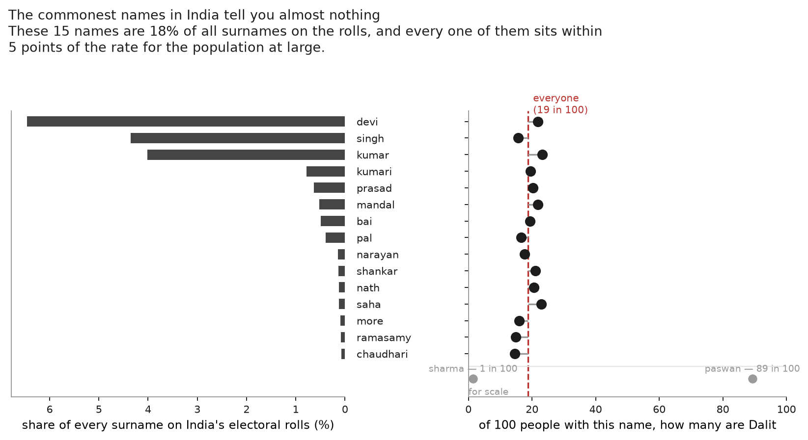
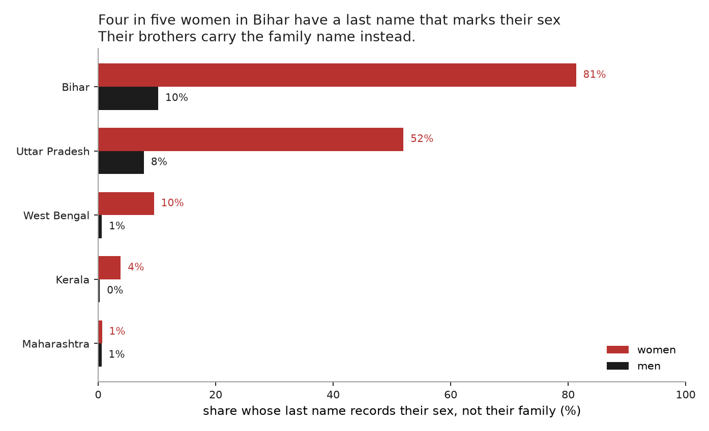
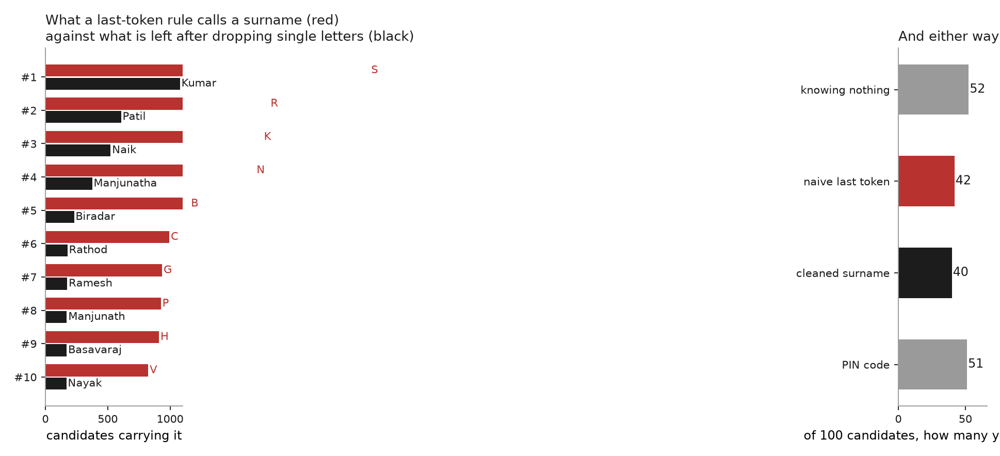
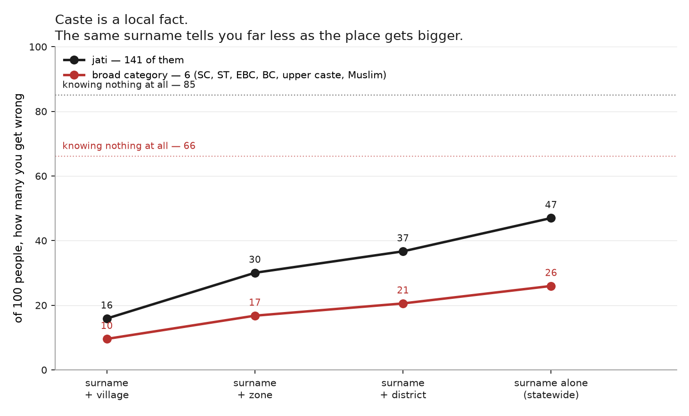
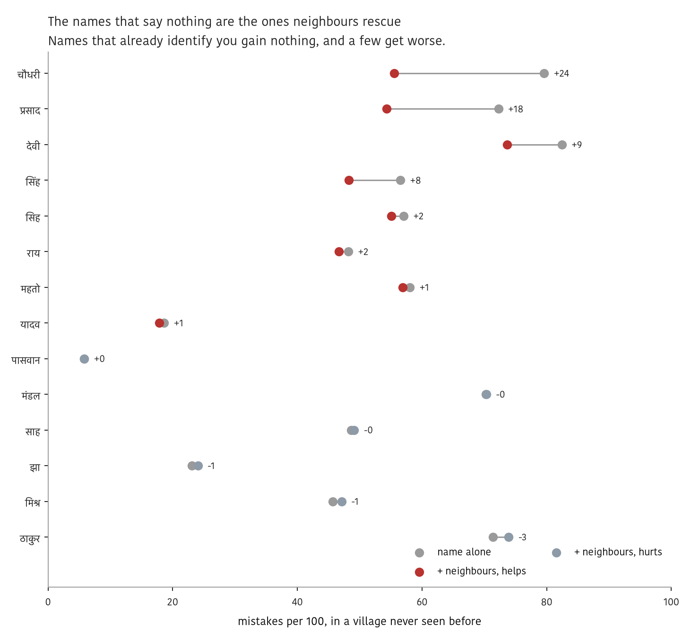
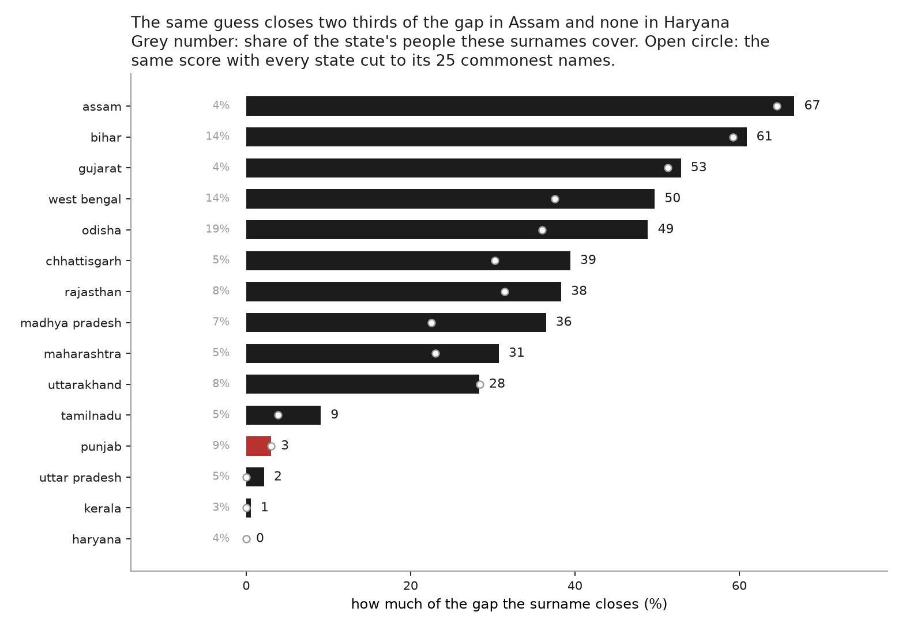
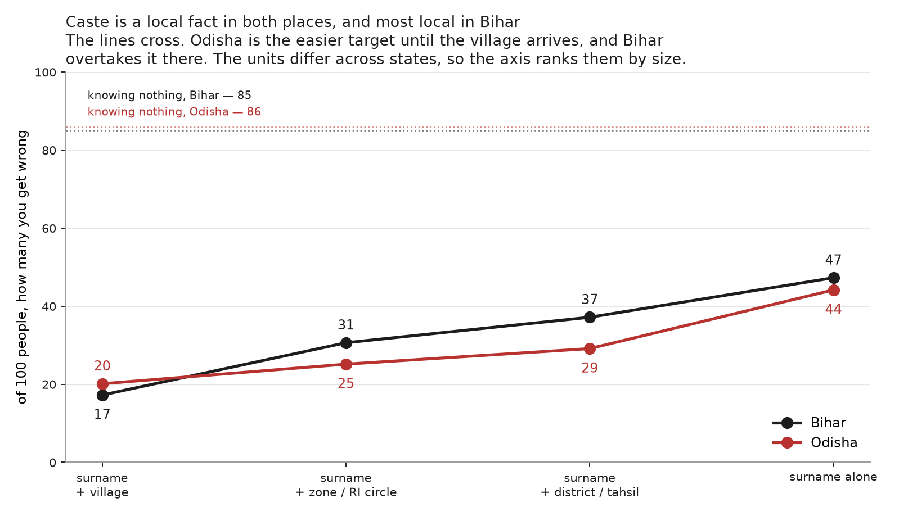
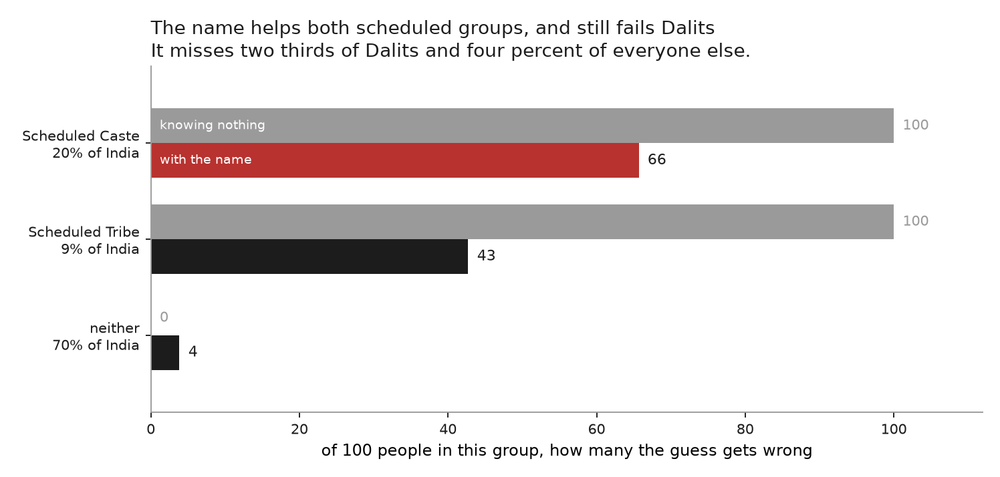
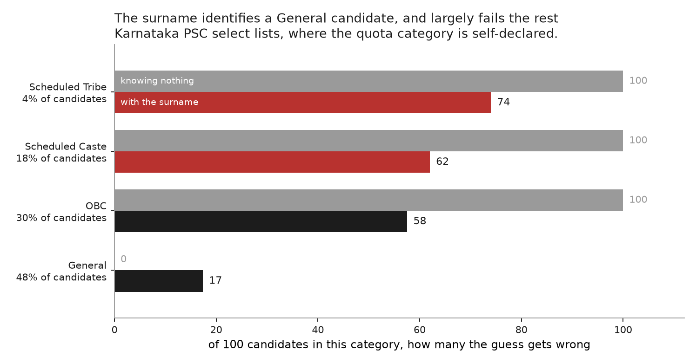

# On a last-name basis

**In a village everyone already knows your caste. In a city a stranger has your
name.**

India is urbanising, and that moves the question of who can identify whom. In a
village, caste is common knowledge: the settlement, the hamlet, whose son you
are, which lane you live on. A city strips most of that away. What survives on a
rental application or a job form is a name.

How much does a last name give away? Anyone acting on caste has to work it out
first, and so does anyone auditing them for it: a study asking whether Dalits
get fewer callbacks usually infers caste from the applicant's name.

This repo measures that inference. It measures what a surname reveals about
caste, whom it reveals least about, and what has to be added to a name before it
reveals a lot.

The operational question: pick an Indian adult at random, know only their last
name, and how often are you wrong about their caste?

**About 20 times in 100.** Knowing nothing at all, you would be wrong 25 times.
The name is worth about five mistakes, and almost all of that comes from a
handful of names hardly anybody carries.

Everything below is measured in that one unit: **of a hundred people, how many
would you get wrong?**

Error rates depend on two things besides the surname. The first is the number of
categories: sorting people into Dalit, Adivasi or neither is easier than placing
them among 141 Bihari jatis, and the same surname leaves 20 mistakes in the
first case and 47 in the second. The second is what else the guesser knows: a
surname with a village is a different predictor from a surname alone.

Given that both vary across the analyses below, each result is reported with its
target and its cues. Error rates computed against different targets are not
comparable.

## The data, and why it takes several kinds

Indian electoral rolls do not record caste, and the caste census does not record
where a household sits relative to its neighbours. Given that no single source
carries both, the analyses below combine four.

| what it gives | what it cannot give | source |
|---|---|---|
| caste composition of a surname, nationally | fine categories; who actually carries the name today | SECC 2011 |
| how common a name is, and who a person's father or husband is | any caste at all | electoral rolls, 2017 |
| jati and hamlet for every household | anywhere outside Bihar; the landless | Bihar land records, Mahadalit census |
| a third population with its own category labels | a population sample of anything | Karnataka PSC lists |

The national picture needs the first two joined. Whether the *place* does the
work the name gets credit for needs the third, because only there can you put a
name and a village together and take the village away. Whether "last name" even
means the same thing across India needs the second and fourth, because that is
where a name can be checked against a relative's name or against an initial.

### Joining caste to frequency

Every national number joins two sources on the surname.

[**outkast**](https://github.com/appeler/outkast) supplies the caste side, from
the 2011 Socio-Economic and Caste Census. For each surname it gives the share of
its bearers who are Scheduled Caste, Scheduled Tribe, or neither. It ships only
cells holding at least 100 records, which leaves **3,930 surnames**.

[**instate**](https://github.com/appeler/instate) supplies the frequency side,
from the 2017 electoral rolls: how many people carry each surname.

The split is deliberate. SECC counts heads of household, who are mostly men, so
it badly undercounts women's surnames: Devi appears 2.3M times in SECC and 45M
times on the rolls, where it is the commonest surname in the country. So how
common a name is comes from the rolls, and what it means comes from SECC.

Filling a room with a hundred people means drawing surnames at their roll
frequency and reading each one's caste mix off SECC. **That room is 19 Dalit, 6
Adivasi, 75 neither.**

**Read every national number here against one limit.** Those 3,930 surnames are
**59% of all the names people carry** on the rolls. The other 41% are the rarer
names, cut by the 100-record floor, and rare names are the informative ones. So
the room is built from the commoner half of Indian naming, which is the half
that reveals least. Every figure below is a floor on what a surname gives away,
not a ceiling.

### The rest

[**Upnaam**](https://github.com/in-rolls/upnaam) resolves which token in a name
is the recorded surname, versioned, for Bihar, Rajasthan and Maharashtra
(analysis 05). `jati`, which is **not a public repository**, and
[**land**](https://github.com/in-rolls/land) hold the Bihar land records and the
Mahadalit census, with a jati and a hamlet for each household (analyses 02 and
06). [**pranaam**](https://github.com/appeler/pranaam) holds the Karnataka
Public Service Commission select lists (analysis 08).

Because analyses 02 and 06 read from a local clone of `jati`, those two cannot
be reproduced from a clean checkout. The other six can.

## 1. A surname reveals little, and the average overstates it

Guess "neither" for everyone in that room of a hundred and you are wrong **25**
times. Let yourself hear the last name and you are wrong **20**.

The five mistakes are not spread evenly, and separating two properties of a
surname explains why. A surname is **predictive** when few of its bearers fall
outside its largest category. It **changes the guess** only when that largest
category differs from the population's. The two are not the same, and the
commonest surnames are often the first without being the second. Yadav is the
fifth commonest surname in India at 2.6% of the roll, and 99% of its bearers
fall outside the schedules, so it leaves 1 mistake per 100. It nonetheless
changes nothing, because "outside the schedules" is what one would have guessed
without it.

For **91% of people the surname does not change the guess at all**. The
surnames that do change it are concentrated in the tail:

| rank by frequency | names | share of India | how many change your answer |
|---|---|---|---|
| 1–10 | 10 | **32%** | **none** |
| 11–25 | 15 | 13% | 2 |
| 26–50 | 25 | 10% | 8 |
| 1001–3930 | 2,930 | 6% | 625 |

The ten commonest surnames cover a third of the country, and none of them moves
the guess off the base rate. The 2,930 surnames ranked 1001 and below cover 6%
of people, and 625 of them do move it.

[](analyses/01_surname_to_category/note.md)

A further **16% of people** carry a surname whose caste composition is more
evenly divided than the population's. `ram` is 45% Dalit and 47% not. That is
real information, and it does not change the decision: the best guess for
someone named Ram is still "neither", and it is wrong 53 times per 100, the same
rate as guessing without the name. Such a surname warrants less confidence in an
answer it does not alter.

*Analysis: [01](analyses/01_surname_to_category).*

## 2. "Last name" is not one thing across India

Part of the answer to claim 1 is that the thing being measured is not stable.
The last token of an Indian name is a family name in some places and something
else in others, and three of the analyses here found it failing in three
different ways.

**It can mark sex rather than family.** The commonest last name in India is
**devi**, at 6.5% of the electoral roll. On the Bihar rolls **81% of women carry
a name from this group against 10% of men**, and the family names in the same
state read as 84 to 89% male, because those families' women are on the roll as
Devi. A woman and her brother do not share a last name, and a name assigned by
sex cannot track a lineage. The clear cases cover **10.5% of the country**, and
adding Singh and Kumar takes it to 19%. Eighteen names cover a quarter of India,
but **103** if you count only names a brother and sister share.

[](analyses/03_how_few_names/note.md)

**It can be in the other position.** Every electoral roll record carries the
elector's father or husband, and a token appearing in both names is one that
passed between two family members. That test confirms the ten sex-marking names,
which all transmit under 1% of the time, and splits the two the hand list called
ambiguous: **Singh transmits 78% of the time and Kumar 8%**. It also found that
**Maharashtra writes the surname first**, as in `patil ashwini` with father
`patil ashok`, so instate's last-token column holds a *given* name there.
Analysis 03's Maharashtra and Gujarat figures were withdrawn.

**It can be an initial.** In Karnataka's Public Service Commission select lists
the last token is a single letter **34% of the time**, and the six commonest are
`S`, `R`, `K`, `N`, `B`, `C`. Drop single letters and the list becomes `Kumar`,
`Patil`, `Naik`, `Manjunatha`: two inventories of "Karnataka's commonest
surnames" from one set of 48,395 names.

[](analyses/08_karnataka_psc/note.md)

Any pipeline that takes the last token and calls it a surname is therefore
measuring something different in each of those places.

*Analyses: [03](analyses/03_how_few_names),
[04](analyses/04_which_token_is_the_surname),
[08](analyses/08_karnataka_psc).*

## 3. The place carries what the name does not

The national figure averages over people whose location is unknown, so it cannot
separate the surname from the place. Bihar's land records identify both. A
surname **and a village** leave **17 mistakes per 100** across 141 jatis; the
surname alone leaves **47**.

Both figures are leave-one-out: when a household is scored, its own record is
excluded from the table used to score it. That matters here because half the
name-and-village cells contain only one household. If its own record is left in,
such a household is matched against itself, and the surname-and-village figure
comes out at 16 instead of 17. The correction is small, but it applies almost
entirely to the surname-and-village rung, which is the rung this comparison
depends on.

[](analyses/02_jati_by_geography/note.md)

**That comparison knows the village in advance**, which is the position of
someone who already knows the place and not of a stranger. Holding whole
villages out of the fitting leaves only the surnames of the *other* households
there as a cue. On the Bihar land records those neighbours save about four
mistakes per 100. The average hides the case: **Chaudhary goes from 80 mistakes
to 56, Prasad from 72 to 54**, while Paswan, which already identifies you at 6,
gains nothing. **The names that carry no caste information alone are the ones
the neighbourhood rescues.**

[](analyses/06_neighbours/note.md)

**How much the place is worth varies enormously by state.** Sorting people into
Dalit, Adivasi or neither, the same guess closes **67% of the gap in Assam and
0% in Haryana**. What carries a state is one or two large, decisive names rather
than many of them: Assam has two majority-Dalit surnames among its commonest and
closes two thirds of the gap, because one of them is `das`. Punjab has five and
closes 3%, because its biggest are `ram` at 62% and `lal` at 52%. Haryana has
none at all. Every state's coverage is printed beside its result, because these
are surnames that cleared a 100-record disclosure floor and they cover between
3% and 19% of a state.

[](analyses/07_where_the_name_works/note.md)

**And the village premium is smaller outside Bihar.** The Odisha Record of
Rights records a jati and a village for every tenant, so the same measurement is
possible elsewhere. In Gajapati district, on the same protocol, **a village adds
20 points where in Bihar it adds 30**. Put as a share of the errors the surname
leaves behind, adding the village removes 42% of them in Gajapati and 64% in
Bihar.

The two levels are not comparable: Bihar sorts people among 141 curated jatis
and Gajapati among several hundred labels as recorded, and a harder target costs
mistakes whatever the surname does. Given that, the comparable quantity is the
distance between the rungs, and both places converge at 47 once the place is
discarded.

[](analyses/09_odisha_village_premium/note.md)

Three of the analyst's choices could have produced that difference, so each was
varied. Collapsing the labels to little more than half as many moves the premium
by half a mistake. Stripping the religion suffix from the jati label moves it
from 19.7 to 15.8. Changing which token is taken as the surname moves it by 0.2.
Gajapati is one district of thirty and is still being scraped, a median of 35
khatiyans per village rather than a census of each, so this is not an Odisha
result, and the sampling biases the premium downward.

*Analyses: [02](analyses/02_jati_by_geography),
[06](analyses/06_neighbours),
[07](analyses/07_where_the_name_works),
[09](analyses/09_odisha_village_premium).*

## 4. The failure is not spread evenly, and the direction is the worst one

An average error rate conceals who bears it. If the uninformative names are not
spread evenly, every name-based caste method has differential error in a knowable
direction.

They are not. Nationally, the guess is wrong about **66 of every 100 Dalits** and
**4 of every 100 people outside the schedules**, a seventeen-fold gap. Those
weight up to the 20 mistakes per hundred it makes across everybody, so this is
one guess split by who it lands on rather than a second estimator.

The name is not useless for Dalits. It takes them from wrong about all of them
to wrong about 66 in a hundred, and it does more still for Adivasis, 100 down to
43. But a large gain still leaves Dalits far and away the worst served.

[](analyses/05_who_has_an_uninformative_name/note.md)

**The same pattern appears on independent data.** Karnataka is absent from the
census extract the rest of this repo runs on, so its Public Service Commission
select lists are the only caste-linked name data available for the state. The
guess there is wrong about **62 of every 100 Scheduled Caste candidates and 17
of every 100 General ones**, an error 3.6 times larger for the group the quota
exists for. That is a different state, a different source and a different set of
labels, pointing the same way. Overall the surname closes 24% of the gap there,
from 52.5 mistakes per 100 to 40.0.

[](analyses/08_karnataka_psc/note.md)

**This is the result with consequences.** Use a name-based method to test whether
Dalits get fewer callbacks, and two thirds of the real Dalits sit in your
comparison group, on both sides of the gap you are trying to measure. The
discrimination is unchanged; your estimate of it shrinks.

The same question asked about sex has no such answer. Women's names cost **3.3
more mistakes per hundred than men's in Bihar**, but 1.4 *fewer* in Rajasthan
and 0.2 fewer in Maharashtra. There is no direction here to report. Read those
three with care: after matching Upnaam's resolved surnames to the caste table
they rest on **57% of the Bihar roll, 36% of the Maharashtra roll and 20% of the
Rajasthan roll**.

*Analyses: [05](analyses/05_who_has_an_uninformative_name),
[08](analyses/08_karnataka_psc).*

## 5. The exposure is in the linkage, not the word

Caste is printed on no electoral roll, so the question a roll actually poses is
what its cues are worth to someone who can match them against a caste register
of the same population. Across 887,512 Scheduled Caste households in 8,307
held-out villages, sorted into 22 jatis: knowing nothing leaves 59 mistakes per
100, the surname alone leaves **30**, neighbours bring that to **26**, and the
name, the father's name and the hamlet together with a caste register leave
**9**.

A surname is a weak instrument. A surname joined to a register is a strong one.

*Analysis: [06](analyses/06_neighbours).*

## The analyses

Each owns its pipeline, data loading, figures, note and `out/`.

| | what it does |
|---|---|
| [01 surname to category](analyses/01_surname_to_category) | what a surname alone reveals, nationally |
| [02 jati by geography](analyses/02_jati_by_geography) | surname against surname-plus-village, Bihar, 141 jatis |
| [03 how few names](analyses/03_how_few_names) | how concentrated Indian naming is, and what a sex-marking name does to that count |
| [04 which token is the surname](analyses/04_which_token_is_the_surname) | which token transmits between family members |
| [05 who has an uninformative name](analyses/05_who_has_an_uninformative_name) | who the guess fails, by their own caste and by sex |
| [06 neighbours](analyses/06_neighbours) | held-out villages, the neighbour cue, and the ceiling with a caste register |
| [07 where the name works](analyses/07_where_the_name_works) | the spread across fifteen states |
| [08 Karnataka PSC](analyses/08_karnataka_psc) | the only caste-linked name data for a state absent from SECC |
| [09 Odisha village premium](analyses/09_odisha_village_premium) | whether the village premium travels outside Bihar |

## Limits

- Analysis 01 covers **SC / ST / Other only**, because SECC has no OBC category.
  The finer categories exist only in analysis 02, and only for Bihar.
- Analysis 02 is **Bihar landowners**, so it under-represents the landless, who
  are disproportionately Dalit and EBC.
- Analysis 03's title list is a judgment call, published in
  [`analyses/03_how_few_names/titles.py`](analyses/03_how_few_names/titles.py)
  with a reason beside each token and reported at three levels so you can take
  the conservative half. Patronymics and OCR debris are further non-surnames it
  does not quantify, so even 19%, the widest of the three levels, is a floor.
- The scoring analyses assume a perfect guesser with one or two cues. That is a
  floor on what is knowable, not a ceiling on what someone can work out about
  you: a real person also has your first name, your father's or husband's name,
  and your neighbourhood.

## What is deliberately not here

No table ranked by how well a name identifies caste. Everything published is
ranked by name frequency, by geography, or looked up by name. The finding is
that a surname alone is a weak signal, and a ranked diagnosticity list would be
a screening tool.

## Run it

```
uv venv .venv
uv pip install --python .venv/bin/python -e '.[dev]'

make all      # the eight scripted analyses: tables, figures, notes
make a01      # just the first, and so on through a09
make a04      # runs the notebook
make test
make lint
```

Each analysis owns its own pipeline, data loading, figures, note and `out/`.
Shared code is only the scoring measure, the drawing style and one data reader:

| path | what |
|---|---|
| `src/last_name_basis/scoring.py` | mistakes per hundred; ladder scoring; leave-one-out |
| `src/last_name_basis/style.py` | palette, hundred-square grid, band definitions |
| `src/last_name_basis/upnaam.py` | validated reader for resolved roll surnames |

MIT licensed.
