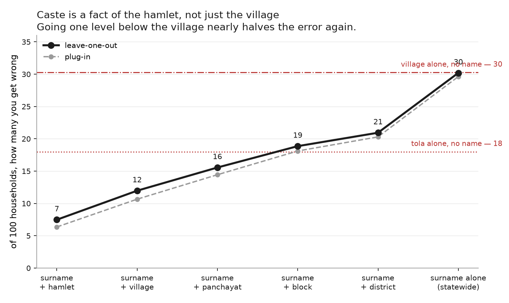
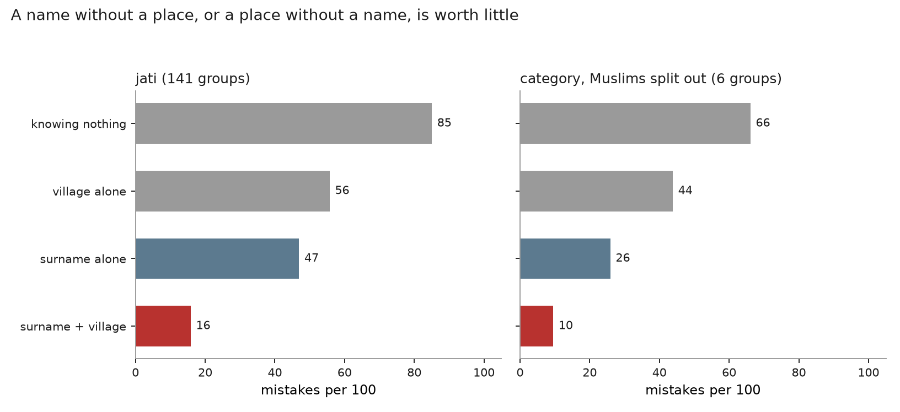
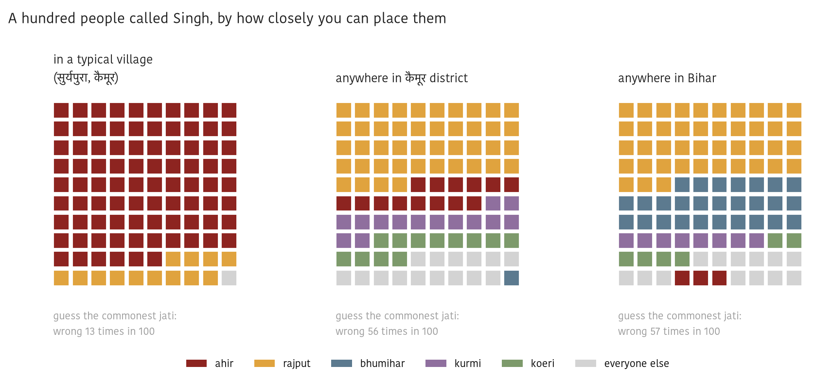

# Jati is a local fact

### How fast does caste information die as the place gets bigger?

*Every number here is generated by `pipeline.py`; the tables are in `out/tab`.*

The other analysis in this repo asks what a surname alone tells you about caste
across India, and finds: not much. This one asks the obvious follow-up. If a
surname alone is weak, is that because surnames are weak — or because we threw
away the place?

Bihar can answer it, because the land records let you put a name and a village
together. The measure is the same one used throughout: **of a hundred people,
how many would you get wrong** if you guessed the commonest group among people
you can place the same way.

## The answer

| what you know about them | mistakes per 100, guessing **jati** | guessing **broad category** |
|---|---|---|
| nothing at all | 85 | 66 |
| surname + village | 16 | 10 |
| surname + zone | 30 | 17 |
| surname + district | 37 | 21 |
| surname alone | 47 | 26 |

Read the surname column upward. Knowing someone's surname and their village
leaves you wrong 16 times in a hundred about which of 141 jatis they belong to.
Keep the surname, throw away the village, and you are wrong 47 times. **Adding
the village cuts the mistakes you would otherwise make by about two-thirds.**

The atrophy is steep and it is orderly: 16 in a village, 30 across a zone, 37
across a district, 47 across the state.

## One rung below the village

The land records stop at the village. Bihar's Mahadalit census does not: it
records the **tola**, the hamlet, and hamlets in Bihar are frequently
caste-segregated to the point of being named for it — `chamar tola`, `mushar
tola`, `harijan tola`.

Across 2,980,126 households and 22 Scheduled Caste jatis, knowing a surname and
a hamlet leaves you wrong **7 times in a hundred**, against 12 at the village
and 30 for the surname alone. One level below the village nearly halves the
error again.

Half of those hamlet cells hold a single household, and a cell of one is
"predicted" perfectly by construction, so every figure here is leave-one-out:
each household is guessed from a cell that excludes it. That moves the hamlet
from 6.4 to 7.5, about one mistake in a hundred, which is why the rung stands.

The hamlet is also doing work on its own. Knowing only which hamlet someone
lives in, with no name at all, leaves you wrong 18 times — better than knowing
only their surname (30). The segregation is that sharp. But the pair is far
better than either piece, which is the same lesson one level up.

These numbers are Scheduled Caste households only, so they are within-Dalit
across 22 jatis and are not comparable to the 141-jati land ladder above.

## Neither the name nor the place, on its own

Knowing only where someone lives, with no name at all, leaves you wrong 56 times
in a hundred. Knowing only the name leaves you wrong 47. Knowing both leaves you
wrong 16. The pair is worth far more than either piece, which is the whole
reason caste reads as legible to people who live somewhere and illegible to
people who move.

## One name, three distances

Singh is a good name to watch, because it is carried by jatis at opposite ends
of the hierarchy — Rajput and Bhumihar near the top, Ahir, Kurmi and Koeri well
below. In one village, 87 of a hundred Singhs are Ahir and you would be wrong 13
times. Widen to the district and the same name is spread across five jatis with
none holding half; you are wrong 56 times. Widening further to the whole state
barely changes it, at 57.

Devi is the opposite kind of name, and the same one that dominates the other
analysis: it is a gender marker, not a caste marker. Even inside a single
village it leaves you wrong about 51 times in a hundred.

## Broad categories atrophy too, from a lower base

Guessing the reservation category rather than the jati is much easier — five or
six groups instead of 141 — but it decays the same way: 10 mistakes with the
village, 26 without it, against 66 knowing nothing.

Splitting Muslims out of those categories changes almost nothing: the five-way
and six-way ladders sit within a point of each other at every rung. That is
itself worth noting — it means surnames already separate Muslim from non-Muslim
about as well as the category data can, so nothing was hiding in the residual.

## What could be wrong with this, and is not

Half the cells at village level hold a single jati, so the sharp village figure
could have been an artifact of tiny cells that are "predicted" perfectly by
construction. It is not. There are no single-person cells, and scoring every
person against a cell that excludes them moves no rung by more than 1.4 of a
mistake per hundred.

## What this does not cover

- **Bihar only.** The ladders are built from Bihar land records and a Bihar
  census. Nothing here generalises to states where jatis, surnames or settlement
  patterns differ.
- **Landowners only.** The records ladder counts land-owning accounts, so it is
  not a random slice of Bihar. It under-represents exactly the landless
  households that are disproportionately Dalit and EBC, and that selection runs
  in an unknown direction for these numbers.
- **The village is doing work you may not have.** The point of the finding is
  that the pair is strong. Nobody meeting a stranger in a city has the village,
  which is what the other analysis measures.

---

*Source: the `records_ladder` and `census_ladder` tables shipped in
[naampata](https://github.com/in-rolls/jati), built from Bihar land records
(4.7M land-owning accounts across 141 jatis) and the Mahadalit census. The
Muslim split uses the caste dictionary in the
[land](https://github.com/in-rolls/land) repo, which carries a religion flag
beside each caste's reservation category.*
