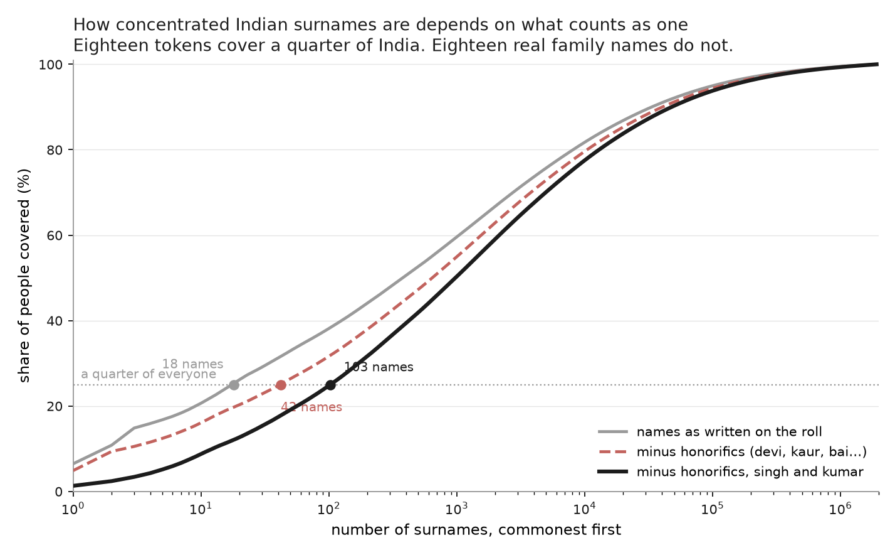
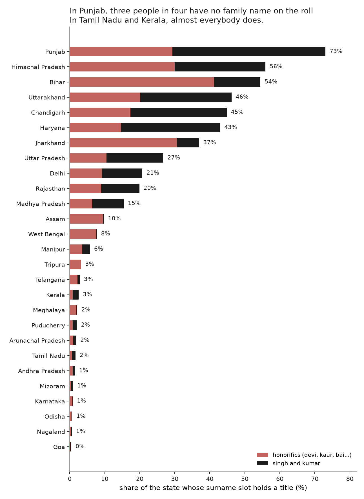
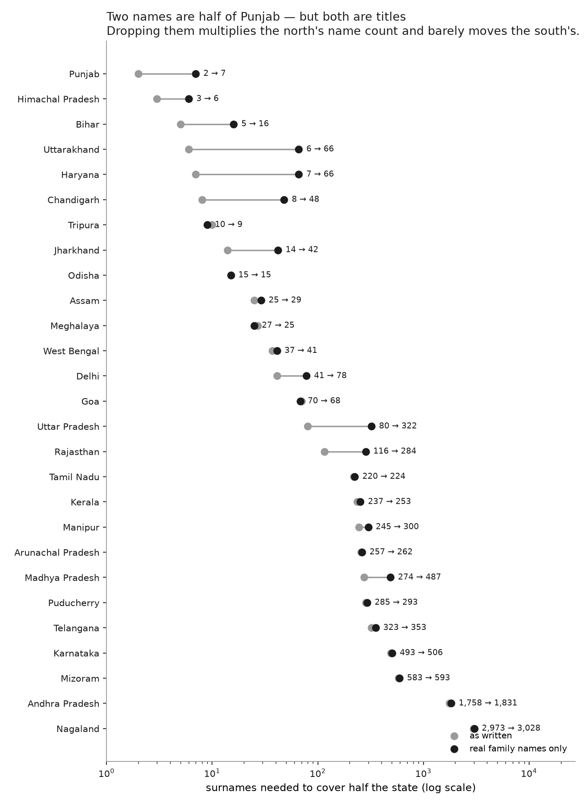
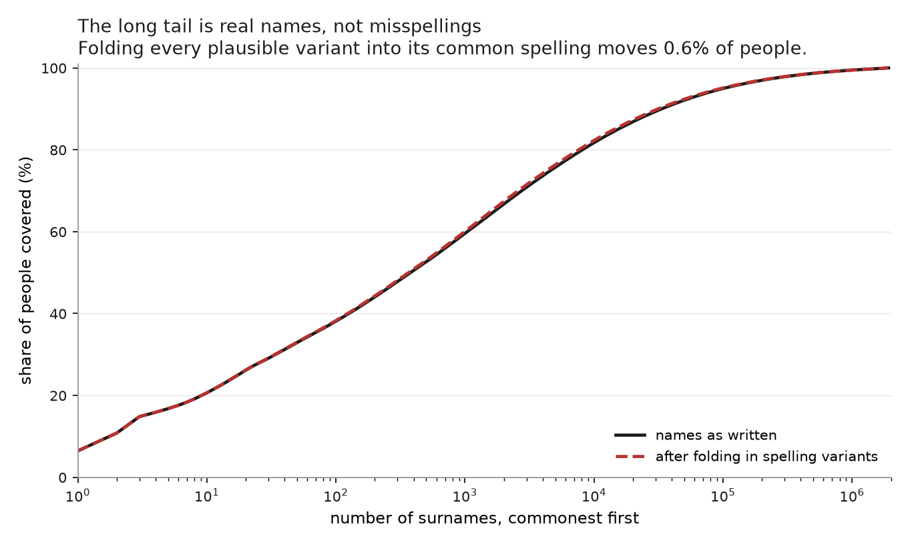

# India's commonest last name tells you nothing

### Because it records your sex, not your family

*Every number here is generated by `pipeline.py`; the tables are in `out/tab`.*

The commonest last name in India is **devi**, carried by 6.5% of the electoral
roll. It is a real last name. It is on the Aadhaar card and the school record,
and it is what the woman is called; nobody appends it as a title any more.

What it does not do is name a family. On the Bihar rolls, **81% of women have a
last name from this group against 10% of men** — and the family names in the
same state read as 84 to 89 percent male, because those families' women are on
the roll as Devi. A woman and her brother do not share a last name.

| state | women whose last name marks their sex | men |
|---|---|---|
| Bihar | 81% | 10% |
| Uttar Pradesh | 52% | 8% |
| West Bengal | 10% | 1% |
| Kerala | 4% | 0% |
| Maharashtra | 1% | 1% |

That is the whole explanation for why these names carry no caste signal. A name
assigned by sex cannot track a lineage. Analysis 01 finds exactly that, without
knowing any of this: devi costs 24 mistakes per hundred against 30 for knowing
nothing at all.

Kumari, Bai, Rani, Begam and Khatun work the same way. Singh and Kumar are the
hard cases: genuinely inherited surnames for many families *and* near-universal
fillers for everyone else, with nothing in the rolls to separate the two uses.
Together these thirteen names cover **19% of the country**.

## They dominate any count of how concentrated Indian names are

| counting | commonest name | names for 25% | names for half |
|---|---|---|---|
| names as written on the roll | 6.5% | 18 | 378 |
| minus sex-marking names | 4.9% | 42 | 643 |
| minus sex-marking names, singh and kumar | 1.3% | 103 | 975 |

Eighteen names cover a quarter of India, but three of them are Devi, Singh and
Kumar. Counting only names that a brother and sister would share, it takes 103.
Every concentration figure depends on a judgment about what counts as a surname,
so all three are reported here, and the list itself is in
[`titles.py`](titles.py) with a reason beside each token, to be argued with
rather than inherited.

## The north-south gap is mostly a titles gap

| state | carries a title | names for half: as written → real |
|---|---|---|
| Punjab | 73% | 2 → 7 |
| Himachal Pradesh | 56% | 3 → 6 |
| Bihar | 54% | 5 → 16 |
| Uttarakhand | 46% | 6 → 66 |
| Chandigarh | 45% | 8 → 48 |
| Haryana | 43% | 7 → 66 |

At the other end:

| state | carries a title | names for half: as written → real |
|---|---|---|
| Nagaland | 1% | 2,973 → 3,028 |
| Goa | 0% | 70 → 68 |
| Maharashtra | 0% | 478 → 480 |
| Gujarat | 0% | 449 → 448 |

Three people in four in Punjab have a title where a surname would go — Singh and
Kaur, given to every Sikh man and woman. In Bihar it is 54%, mostly Devi. In
Tamil Nadu it is 2% and in Kerala 3%.

So the story is not that northern names are concentrated and southern names are
diverse. It is that in much of the north most people do not carry a family name
on the roll at all. Drop the titles and Punjab goes from 2 names to 7, Haryana
from 7 to 66, while Kerala barely moves.

## What each of them costs you

Guessing the caste of someone you know nothing about costs 30 mistakes per
hundred. Here is what each of these names costs:

| token | share of the roll | mistakes per 100 |
|---|---|---|
| devi | 6.5% | 24 |
| singh | 4.4% | 22 |
| kumar | 4.0% | 26 |
| khatun | 0.8% | 1 |
| kumari | 0.8% | 20 |
| kaur | 0.8% | 31 |
| bibi | 0.5% | 0 |
| bai | 0.5% | 48 |

Every one of the large Hindu names lands at or worse than knowing nothing. The
Muslim ones score well only because they mark religion, and the census files
Muslims under "Other" — they are separating faith, not caste.

The first analysis found that for 91% of people a last name does not change your
best guess. This is the mechanism. A fifth of the country carries a name that
identifies their sex instead of their family.

## Is the long tail just misspellings?

A reasonable suspicion, since these names are parsed from scanned rolls. It does
not survive measurement: folding every plausible variant into its common
spelling merges 13,988 names and moves 4.5 million people, **0.6% of the roll**.
The curve does not visibly shift.

Matching is deliberately narrow, because a loose rule is worse than none. Edit
distance alone merges `raul` into `raut`, `ari` into `ali` and `ajam` into
`alam`, which are different names rather than different spellings. Only three
kinds of edit are accepted — a vowel written as another vowel (`kamar`/`kumar`),
a doubled consonant written single (`hassan`/`hasan`), and an aspirating `h`
present or absent (`sahu`/`shahu`). The 200 largest merges are in
`out/tab/variant_merges.csv`.

## What bounds these numbers

- **The list is a judgment.** It is published, split into the unambiguous cases
  and the two hard ones, and every figure is reported at all three levels so a
  reader can take the conservative half.
- **Sex-marking names are not the only thing in the last-name slot.**
  Patronymics are common in the south, and scanned rolls carry OCR debris.
  Neither is quantified here.
- **The sex split depends on naming a first name's gender**, which naampy can do
  for only part of each roll: 61% of Bihar, 30% of Uttar Pradesh, 4% of Tamil
  Nadu. Anything under a fifth is dropped rather than reported, which is why
  Tamil Nadu is absent from that table.
- **Names appearing once or twice are absent**, and so are names shorter than
  three letters. The second matters most in the south: in Kerala's public
  service records, **78% of candidates have a last token that is a single
  initial**, the Malayali convention of putting the house or father's name there
  as a letter. Those people are not in this data at all, so Kerala's 253 names
  describe only the Keralites who carry a spelled-out name.
- **These are electoral rolls**: adults, and transcriptions.

---

*Surname frequencies from [instate](https://github.com/appeler/instate)'s 2017
electoral-roll counts. The mistakes-per-100 column comes from
[outkast](https://github.com/appeler/outkast)'s SECC 2011 extract, the same
source as analysis 01. The Kerala initial share is computed from the name field
of the Kerala PSC records in [pranaam](https://github.com/appeler/pranaam) and
touches no caste field.*
