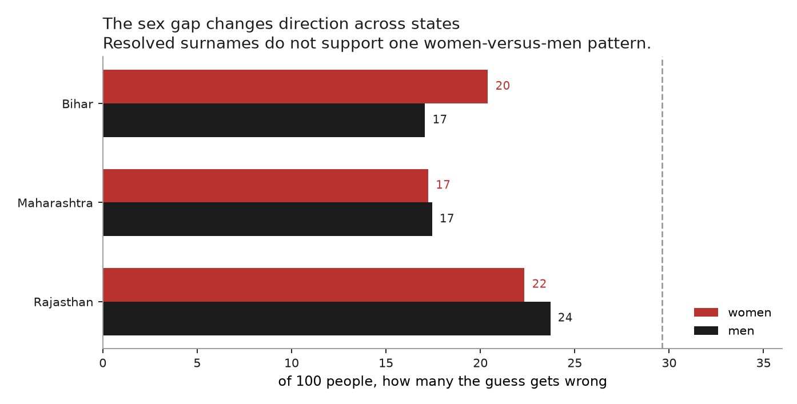

# Whose name tells you nothing

### The errors are not spread evenly, and the direction matters

*Every number here is generated by `pipeline.py`; the tables are in `out/tab`.*

The other analyses in this repo report an average: a surname saves about ten
mistakes per hundred, and for most people it changes nothing at all. An average
hides who. If the uninformative names are not spread evenly across people, then
every name-based caste method has a differential error rate in a knowable
direction, and anyone using one ought to know which way it runs.

It is not spread evenly.

## The guess is wrong about two thirds of Dalits and four percent of everyone else

Score the same guess separately on each group. Knowing nothing, the best you can
do is name the largest group and say it every time, which is right about all of
that group and wrong about everyone else. Then let the name in.

| your caste | share of India | wrong knowing nothing | wrong with the name | vagueness of the names you carry |
|---|---|---|---|---|
| Scheduled Caste | 20% | 100 | 66 | 29 |
| Scheduled Tribe | 9% | 100 | 43 | 21 |
| neither | 70% | 0 | 4 | 17 |

The guess is wrong about **66 of every 100 Dalits** and **4 of every 100 people
outside the schedules**. That is a 17-fold gap, and it is the number to carry
away. Weight the two middle columns by the shares beside them and they come to
30 and 20, the mistakes per hundred a blind guess and a name-based guess make
across everybody. This is one estimator split by who it is applied to, not a new
one.

Note what the table does **not** say. The name is not useless for Dalits: it
takes them from wrong about all of them to wrong about 66 in a hundred. It does
more for Adivasis, 100 down to 43. It does nothing for people outside the
schedules and in fact costs them 4 per hundred, because knowing nothing already
had them right. The trouble is that a large gain still leaves Dalits far and
away the worst served.

The last column is a different quantity and is kept because it is the one the
mistake is easy to make with. It is how vague the names a group carries are --
one minus the largest share in the name's own composition, averaged over that
group's bearers. It is a property of names, not of people, so it cannot be read
as how often the guess is wrong about someone.

So the method is not weakly accurate across the board. It is accurate about the
advantaged and poor about the disadvantaged, which is the opposite of what a
user assuming uniform error would expect, and it runs in the direction that
makes a naive audit understate discrimination against exactly the group the
audit is for: two thirds of the Dalits in the data land in the comparison group,
on both sides of the gap being measured.

## By sex, there is no consistent story

The obvious next guess is that women fare worse, since a woman in the Hindi belt
is often recorded under a name that marks her sex rather than her family. That
was my prediction. It does not hold.

| state | mistakes on men | on women | gap |
|---|---|---|---|
| Bihar | 17 | 20 | +3.3 |
| Maharashtra | 17 | 17 | -0.2 |
| Rajasthan | 24 | 22 | -1.4 |

Women are worse off in Bihar by 3.3 mistakes per hundred and better off in
Rajasthan by 1.4. The direction reverses. A sex-marking name is not
automatically a worse-predicted one: Devi puts you at the base rate, and plenty
of the names men carry in these states — Ram, Das, Lal — are worse than the base
rate. Reported here because it was the prediction going in.

## What this means for anyone using a name-based method

The caste result is the one to carry away, and it is not a caveat. Any method
that infers caste from an Indian surname — this repo's, outkast's, a BISG-style
transfer — will **miss most Scheduled Caste individuals while classifying nearly
everyone else correctly**. An audit that assumes uniform error understates the
error made on Dalits by about 62 mistakes per hundred.

## Limits

- **SC / ST / Other only**, since that is what the census extract has. The OBC
  and forward line is invisible, and the differential could look different
  across it.
- **The caste split is computed from the same table it evaluates.** It is a
  decomposition of a known distribution, not an out-of-sample test, so it
  describes the ceiling a perfect user of this table would hit rather than the
  performance of any fitted model.
- **The sex split covers only Bihar, Rajasthan, and Maharashtra**, the states
  supported by Upnaam's `resolver-v1` and present locally. It uses Upnaam's
  recorded surname, not a resolved family surname.
- **The sex split needs a given name naampy can gender, and a surname the caste
  table knows.** After both, the estimates rest on 57% of the Bihar roll, 36% of
  the Maharashtra roll and 20% of the Rajasthan roll. Each earlier step looks
  healthier: Maharashtra resolves a surname for 98% of its roll and genders one
  for 66%, but a surname that is gendered and then has no caste row never
  reaches the estimate. Bihar is the only one of the three built on most of a
  state.
- **Nothing here is per-name.** The tables report groups, never a ranked list of
  which names give which people away.

---

*Caste composition from [outkast](https://github.com/appeler/outkast)'s SECC
2011 extract, the same source as analysis 01. Sex from
[naampy](https://github.com/appeler/naampy)'s first-name counts applied to
[Upnaam](https://github.com/in-rolls/upnaam)'s `resolver-v1` aggregate roll
outputs.*
