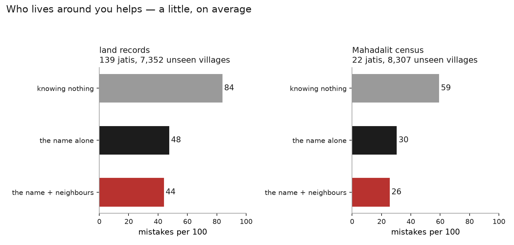
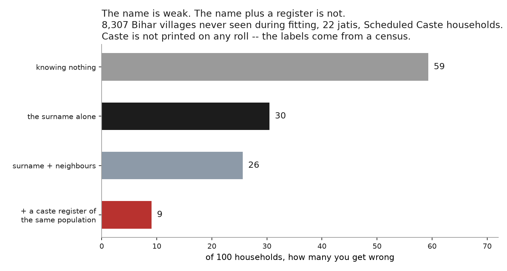

# Does knowing your neighbours give you away?

*Every number here is generated by `pipeline.py`; the tables are in `out/tab`.*

Analysis 02 shows that a surname plus a village beats a surname alone by a wide
margin. That comparison **memorises the village**: it learns the jati mix of
each particular village and looks yours up. It says nothing about a stranger in
a village nobody has seen before, which is the position anyone actually
inferring caste is in.

So hold out whole villages. On a held-out village the memorised table does not
exist, and the only thing left is the **composition of the other surnames**
there. Caste segregation within villages is real, so the surnames around you are
a cue about you — and if that cue generalises, this repo's negative result needs
qualifying.

## On average, it helps a little

| | jatis | knowing nothing | name alone | name + neighbours | saved |
|---|---|---|---|---|---|
| land records | 139 | 84 | 48 | 44 | +3.7 |
| Mahadalit census | 22 | 59 | 30 | 26 | +4.8 |

Around four mistakes per hundred, in villages never seen during fitting. Real,
and nowhere near the 48-to-17 gap that memorising the village itself would
close.

Part of the reason is that Bihar's villages are less segregated than the
question assumes. Among landowning households the median village holds **seven
jatis, with the commonest at 52%** of the households.

## But the average hides the answer

The claim worth testing was never about the mean. It was that *Kumar tells you
nothing, and Kumar living among Yadavs may tell you a great deal*. That is a
claim about particular names, and the mean can move by four while those names
move by twenty.

They do.

| name | alone | + neighbours | saved |
|---|---|---|---|
| चौधरी | 80 | 56 | +24 |
| प्रसाद | 72 | 54 | +18 |
| देवी | 82 | 74 | +9 |
| सिंह | 57 | 48 | +8 |
| सिह | 57 | 55 | +2 |

And at the other end, some names gain nothing or get worse:

| name | alone | + neighbours | saved |
|---|---|---|---|
| साह | 49 | 49 | -0 |
| झा | 23 | 24 | -1 |
| मिश्र | 46 | 47 | -1 |
| ठाकुर | 71 | 74 | -3 |

Chaudhary goes from 80 mistakes per hundred to 56. Prasad from 72 to 54. Devi
and Singh gain eight or nine. Paswan, which already puts you at six mistakes,
gains nothing at all, and Thakur gets three worse.

The pattern is the finding: **the surnames that carry no caste information on
their own are, on the whole, the ones the neighbourhood rescues.** A filler name
is uninformative in isolation and not uninformative in place.

It is a tendency and not a law. Thakur costs 71 mistakes alone and gets three
*worse* with neighbours: the model is confident about the jati mix around a
Thakur household and confidently wrong. Jha and Mishra lose a point the same
way. In the Scheduled Caste census the same thing happens to Devi (down
fourteen) and Kumar (down eight), while Sada, Rishi and Ravidas, which already
identify a jati, gain nothing.

So the repo's headline needs a qualification rather than a retraction. A surname
alone is weak. A surname is not weak once you know where its bearer lives, and
that is true even for a village the guesser has never seen.

## How this was measured, and one design that failed

Villages are split 70/30. Everything, including `P(jati | surname)`, is
estimated on training villages only, so a test village leaks nothing. For a
person with surname *S* in village *V*, the cue is built from every household in
*V* that does **not** share their surname, so the feature can never contain the
answer. The two signals combine as

`log P(jati | S) + alpha * sum_t f_t log P(t | jati)`

where `f_t` is the share of those other households carrying surname *t*, and
`P(t | jati)` — which surnames people of a jati live among — is learned on
training villages. One parameter, fit on the training half.

The first attempt was worse and would have produced a false null. It averaged
`P(jati | surname)` over the neighbours, which yields a near-uniform smear:
entropy 3.83 against a maximum of 4.93 across 139 jatis. A predictor built on it
scored 87 mistakes against a blind 84 — worse than knowing nothing — and the
combined model "improved" the headline by 0.1, which is noise wearing the
clothes of a result. What caught it was scoring the neighbour cue **on its
own**, which is now a permanent check: neighbours alone must stay bad, because
co-occurrence cannot identify you, only tilt you.

A second correction: the mixing parameter was first searched over a range that
topped out at 1.2, and the optimum was past it. Widening the search moved the
gain from 1.9 mistakes per hundred to 3.7.

## The other end of the bracket

The question this repo keeps asking is what a surname gives away when it is all
you have. The answer is a floor. It is worth finishing the sentence and asking
what the *most* an ordinary reader of a public document could do.

Be precise about who this adversary is, because an earlier draft of this section
overstated it. The **cues** are all printed on an electoral roll page: the name,
the father's or husband's name, and the hamlet. The **labels** are not. Caste
appears on no roll, so knowing which name-and-hamlet combinations go with which
jati has to come from a caste-labelled register -- a census, or a state caste
survey. Both exist.

So this is not a stranger with a roll page. It is someone holding a caste
register for the same population and reading your entry in the roll.

| what the guesser has | mistakes per 100 |
|---|---|
| nothing | 59 |
| the surname alone | 30 |
| surname + neighbours | 26 |
| **+ a caste register of the same population** | **9** |

**The name is weak. The name joined to a register is not.** A surname alone
leaves 30 mistakes per hundred across 22 jatis. The same surname, plus the
father's name and the hamlet from the roll, matched against a caste register,
leaves 9.

All four rows are scored on **the same held-out villages**, so they answer one
question rather than two. That alignment had to be forced: naampata's ladder
covers 27,687 villages and the raw census files 28,602, and splitting the two
lists independently put only 2,509 of some 8,300 test villages in common, which
had the bracket describing different people in different rows.

The two sources still count households slightly differently inside those
villages -- 834,908 in the ladder against 887,512 in the raw files, because the
ladder retains about six percent fewer. Scoring every household rather than the
held-out ones moves the ceiling from 9.04 to 9.12, so nothing here turns on the
choice.

That reframes what the repo has been measuring. The finding is not that caste is
hard to infer in India. It is that the *name* is a poor instrument and the
*join* is a good one. The exposure is not in the word, and not in any single
document: it is in the fact that a public roll and a caste register describe the
same people and can be laid on top of each other.

### The number that was nearly published instead

The first version of this said **1.2**, and it was wrong in a way worth
recording. Scoring each household against a cell that excludes it is the right
idea, but at the finest cue only **36%** of households share a cell with anyone
else — those are the people with a same-named relative in the same hamlet, and
they are the easy ones. The households nobody could resolve were being dropped
rather than counted as errors, so the figure described a third of the population
and flattered it eightfold.

The fix is to make the guesser answer for everybody: when the finest cue cannot
resolve someone, fall back to a coarser one, and when nothing resolves, fall
back to the commonest jati. Only 1.3% of households need that last resort. That
is the difference between 9.0 and 1.2.

## Limits

- **Bihar only**, and the land-records ladder covers landowning households,
  which excludes the landless — disproportionately Dalit and EBC.
- **Village-level composition, not true neighbours.** Electoral rolls carry
  house numbers and walk order, which would give the twenty people actually
  around you, but rolls carry no caste, so a finer cue could not be scored. It
  is left unmeasured rather than reported unvalidated.
- **The ceiling is Scheduled Caste households only**, across 22 jatis, so it is
  not comparable to the all-India SC/ST/Other bracket of 30 to 20. And it is
  conservative in one direction and optimistic in the other: a real reader of
  the roll also sees age, sex and true walk-order neighbours, which cannot be
  scored here; but a better model than a fallback chain would do more with the
  cues that are here.
- **The model is not published.** These are aggregate error rates. No fitted
  object, no per-person output, and the per-name table is ranked by how common a
  name is, not by how much it gives its bearer away.

---

*Bihar land records and the Mahadalit census, via the ladders in naampata, the
same source as analysis 02. That repository is not public.*
