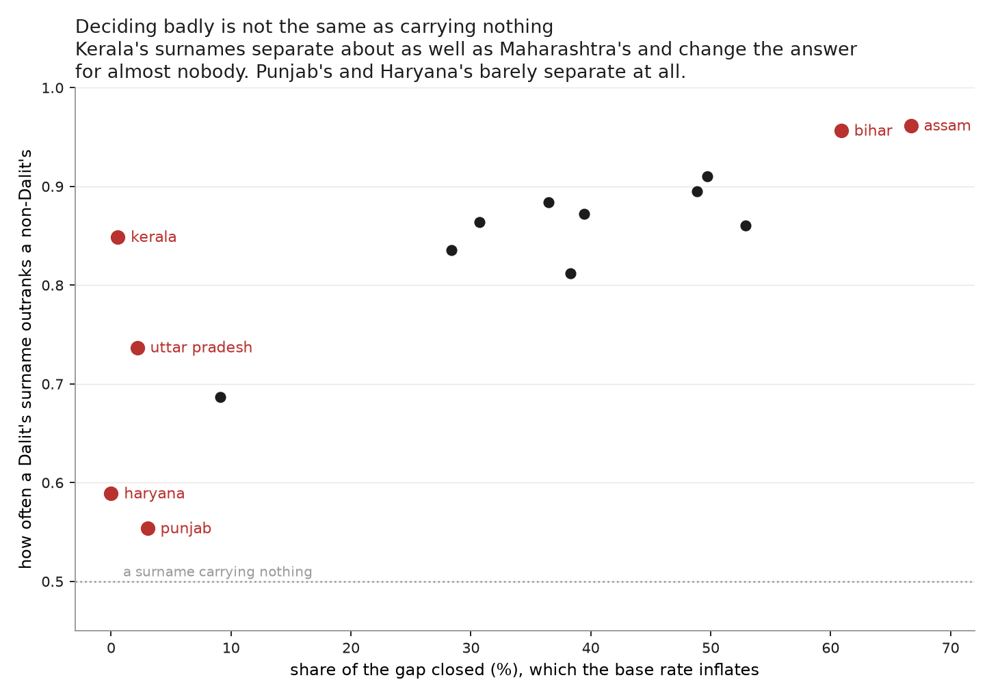
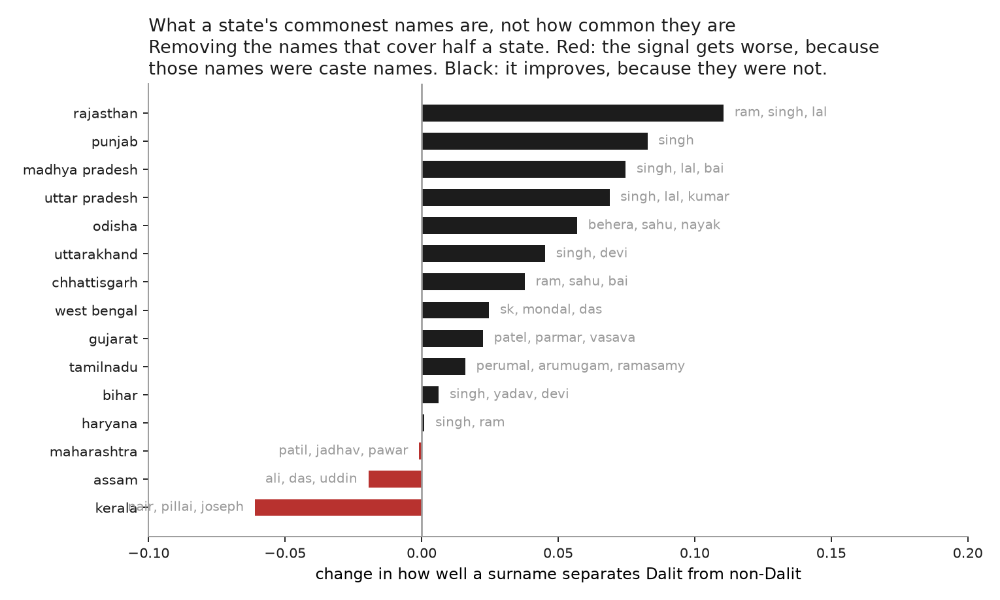
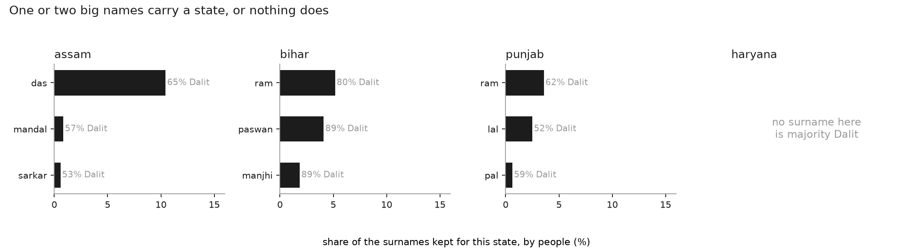

# Where a surname works, and where it does not

Analyses 01 and 05 give one national number and split it by caste. Neither says
*where* in India a name works, and the spread across states is much wider than
the national figure suggests. The same guess closes **67% of
the gap in Assam** and **0% in
Haryana**.

This is a description, not an explanation. An earlier version of this analysis
tried to explain the spread by how concentrated a state's names are. That does
not hold: concentration measured on the electoral roll correlates with the
result at +0.02, and measured inside the extract itself at -0.27. The spread is
real and worth showing; the reason for it is not established here.

## Read the coverage column first

Every number below describes the surnames that cleared outkast's 100-record
disclosure floor in that state, not the state. Those surnames cover between
**3% and 19%** of a state's Census 2011 population, a factor of
six: Kerala at 3% against
Odisha at 19%. Coverage does
not track the result -- Assam closes the largest gap on 4% of its people and
Odisha closes half of one on 19% -- so it is a caution about reading levels,
not a correction to apply.

| state | gap closed (%) | ranks Dalit higher | top 25 names only | covers | names |
|---|---|---|---|---|---|
| assam | 67 | 0.96 | 65 | 4% | 161 |
| bihar | 61 | 0.96 | 59 | 14% | 557 |
| gujarat | 53 | 0.86 | 51 | 4% | 390 |
| west bengal | 50 | 0.91 | 38 | 14% | 616 |
| odisha | 49 | 0.89 | 36 | 19% | 457 |
| chhattisgarh | 39 | 0.87 | 30 | 5% | 120 |
| rajasthan | 38 | 0.81 | 31 | 8% | 242 |
| madhya pradesh | 36 | 0.88 | 23 | 7% | 345 |
| maharashtra | 31 | 0.86 | 23 | 5% | 751 |
| uttarakhand | 28 | 0.84 | 28 | 8% | 43 |
| tamilnadu | 9 | 0.69 | 4 | 5% | 715 |
| punjab | 3 | 0.55 | 3 | 9% | 29 |
| uttar pradesh | 2 | 0.74 | 0 | 5% | 612 |
| kerala | 1 | 0.85 | 0 | 3% | 230 |
| haryana | 0 | 0.59 | 0 | 4% | 36 |

## Two measures, and where they disagree

The gap-closed column is accuracy against the largest category, so a state's
composition moves it as much as its surnames do. The next column is not: take
one Dalit and one non-Dalit from the state at random, rank the pair by what
their surnames say, and it is how often the Dalit ranks higher. A surname
carrying nothing gives 0.50.

The two agree on the ordering broadly and part company at the bottom, which is
where the conclusion lived. Kerala closes under 1% of the gap and ranks at
0.85, about level with Maharashtra at 0.86. Kerala's
surnames separate Dalit from non-Dalit perfectly respectably; they seldom change
the answer because only 8% of its extract is Scheduled Caste, so
raising the odds still rarely crosses a half.

Punjab and Haryana are different. At 0.55 and 0.59 against a
floor of 0.50, those are states whose surnames genuinely carry little about
caste. Grouping them with
Kerala, as the gap-closed column alone does, puts two unlike things together.

## Why Punjab's surnames carry so little

Punjab ranks 0.55, the lowest of the
fifteen and barely above the 0.50 a surname carrying nothing would give. Its
three commonest surnames on the electoral roll are

`singh` 38%, `kaur` 26%, `kanr` 7%

and the first two cover **64% of the state**, nearer 71% once `kanr`,
which is `kaur` misspelled, is counted with `kaur`.

The obvious reading is that concentration is the cause, and it is not, or not on
its own. Bihar's three commonest names touch 78% of its pairs and Bihar ranks
0.96. Assam is more concentrated than Punjab by that measure and ranks 0.96. A
state can have very few names and very informative ones.

What separates them is whether the dominant names sit where the state sits.

| state | its dominant names | pairs touching one | all names | without them | change |
|---|---|---|---|---|---|
| rajasthan | ram, singh, lal | 80% | 0.81 | 0.92 | +0.11 |
| punjab | singh | 93% | 0.55 | 0.64 | +0.08 |
| madhya pradesh | singh, lal, bai | 71% | 0.88 | 0.96 | +0.07 |
| uttar pradesh | singh, lal, kumar | 80% | 0.74 | 0.81 | +0.07 |
| odisha | behera, sahu, nayak | 79% | 0.89 | 0.95 | +0.06 |
| uttarakhand | singh, devi | 82% | 0.84 | 0.88 | +0.05 |
| chhattisgarh | ram, sahu, bai | 72% | 0.87 | 0.91 | +0.04 |
| west bengal | sk, mondal, das | 76% | 0.91 | 0.93 | +0.02 |
| gujarat | patel, parmar, vasava | 70% | 0.86 | 0.88 | +0.02 |
| tamilnadu | perumal, arumugam, ramasamy | 75% | 0.69 | 0.70 | +0.02 |
| bihar | singh, yadav, devi | 78% | 0.96 | 0.96 | +0.01 |
| haryana | singh, ram | 83% | 0.59 | 0.59 | +0.00 |
| maharashtra | patil, jadhav, pawar | 73% | 0.86 | 0.86 | -0.00 |
| assam | ali, das, uddin | 84% | 0.96 | 0.94 | -0.02 |
| kerala | nair, pillai, joseph | 62% | 0.85 | 0.79 | -0.06 |

A positive change means the dominant names were dead weight and the guess
improves once they are gone. A negative one means they were carrying the signal.
Kerala's `nair` and `pillai` are 0.00 and 0.00 Dalit against a state base of
0.08, so they identify a great deal and removing them makes the guess worse.
Punjab's `singh` does not.

## One name, doing opposite work

The mechanism is clearest in a single surname, and needs no index at all.

| state | singh's share of the state | singh's Dalit share | the state's | difference |
|---|---|---|---|---|
| west bengal | 1% | 0.25 | 0.29 | -0.04 |
| odisha | 1% | 0.08 | 0.19 | -0.12 |
| chhattisgarh | 6% | 0.03 | 0.11 | -0.08 |
| bihar | 9% | 0.00 | 0.18 | -0.18 |
| rajasthan | 18% | 0.09 | 0.18 | -0.09 |
| uttar pradesh | 18% | 0.14 | 0.21 | -0.07 |
| madhya pradesh | 22% | 0.08 | 0.14 | -0.06 |
| uttarakhand | 41% | 0.07 | 0.20 | -0.13 |
| haryana | 47% | 0.20 | 0.24 | -0.03 |
| punjab | 73% | 0.38 | 0.38 | -0.01 |

In Bihar, `singh` is carried by 9% of the extract and almost none of them are
Dalit, against a state that is 18% Dalit. Knowing someone there is called Singh
tells you a great deal. In Punjab it is carried by 73% and its Dalit share is
0.38 against a state of 0.38. Knowing someone there is called Singh tells you
what you already knew.

Across these states the correlation between how much of a state a name covers
and how far its composition sits from the state's is
-0.51. **A name that spreads to
everyone stops distinguishing anyone**, and that is a process rather than a
measurement problem: Singh and Kaur were adopted across castes, and the caste
information a surname once carried went with the adoption. Haryana, at 47% and
a difference of -0.03, sits where that account predicts.

The correlation is moderate and the table shows why: Uttarakhand carries `singh`
on 41% of its extract and it still sits 0.13 from the state, which the account
does not explain. Ten states is also few enough that one such case moves the
number appreciably. The two ends are the solid part of this, and the middle is
not.

What this is not is an identified mediation. Nothing here is randomised and no
counterfactual is estimated. It describes where the pairs sit, and the residual
is real: Punjab's other names reach only
0.64
against Bihar's
0.96, and
Punjab retains 28 non-dominant names against Bihar's 547 because the disclosure
floor keeps 29 Punjabi surnames covering 9% of the state.

## Two sources, and where they stop agreeing

Every concentration figure in analysis 03 comes from instate. These come from
upnaam's resolved rolls, a different collection through a different pipeline, so
for the first time a number here can be checked against a second source.

| state | names for half, instate | roll | top ten, instate | roll |
|---|---|---|---|---|
| bihar | 5 | 4 | 65% | 67% |
| punjab | 2 | 2 | 85% | 88% |
| rajasthan | 116 | 5 | 31% | 67% |

Bihar and Punjab agree closely. Rajasthan does not, and the reason is known: the
resolver abstains on two thirds of that state, so the roll's distribution
describes a selected third rather than Rajasthan. The disagreement is the check
working. Maharashtra cannot be compared at all, because analysis 04 found it
writes the surname first and analysis 03 withdrew it.

## The obvious objection, tested

The floor keeps a state's *commonest* names, and this repo's own finding is that
common names are the uninformative ones. So a state that retains few names might
look uninformative purely by construction, and Punjab retains 29 against Tamil
Nadu's 715.

Cutting every state to its 25 commonest names holds that constant. The ordering
survives (rank correlation
0.98): Assam and Bihar stay near the
top, Punjab, Haryana, Kerala and Uttar Pradesh at the bottom. That is the second
column above, and the open circles in the figure.

## What carries a state is one or two big names

Not a count of them. Punjab has five majority-Dalit surnames among its 25
commonest and closes 3% of the gap; Assam has two and
closes 67%.
The difference is that one of Assam's is `das`.

| state | its decisive surnames |
|---|---|
| Assam | `das` (10.4% of them, 65% Dalit), `mandal` (0.8% of them, 57% Dalit), `sarkar` (0.6% of them, 53% Dalit) |
| Bihar | `ram` (5.2% of them, 80% Dalit), `paswan` (4.1% of them, 89% Dalit), `manjhi` (1.9% of them, 89% Dalit) |
| Punjab | `ram` (3.6% of them, 62% Dalit), `lal` (2.5% of them, 52% Dalit), `pal` (0.6% of them, 59% Dalit) |
| Haryana | none |

Punjab's two largest majority-Dalit names are `ram` at 62% and `lal` at 52%,
barely over the line and covering 6% of its retained surnames between them.
Bihar's are `paswan` and `manjhi` at 89%. Haryana has none at all: not one of
its 36 retained surnames is majority Dalit.

## What the extract will not tell you

**A state's Scheduled Caste share.** The extract is not a census. It puts Punjab
at 38% Scheduled Caste,
which is higher than the Census figure for Punjab. Read the `covers` column
before reading anything into a base rate here.

**A comparison of gap-closed between states with different base rates.** A
surname "points Dalit" when over half its bearers are, and that bar sits at
7.6% of the extract in Kerala against
38.1% in Punjab, so the test is far more lenient
there. Compare the ranking column across states instead, which is what it is
for; the gap-closed column is comparable only among states of similar
composition.

**Kerala's figure, without a caveat.** It ranks
0.85 here, on instate's last names:
`nair`, `joseph`, `pillai`, 21.2M tokens against a state of 33.4M. Analysis 10
finds that in Kerala PSC lists 78% of last tokens are a single letter and only
27% of people have a written surname. This figure therefore describes Keralans
who have a surname, which is not most of them.

**Any claim about people whose surnames were suppressed.** The floor removes
rare names, and analysis 01 shows rare names are the informative ones. These
figures are a floor on what surnames reveal, not a ceiling.

## Why there is no leave-one-out column

Every cell here holds at least 100 records, so removing one person cannot flip
which category a surname points to. Leave-one-out returns the plug-in number
exactly, in every state. Elsewhere in this repo the two differ a great deal, and
the reason they do not here is the disclosure floor.

---

*Caste composition from [outkast](https://github.com/appeler/outkast)'s SECC
2011 extract, the same source as analyses 01 and 05. State populations from
Census 2011.*
