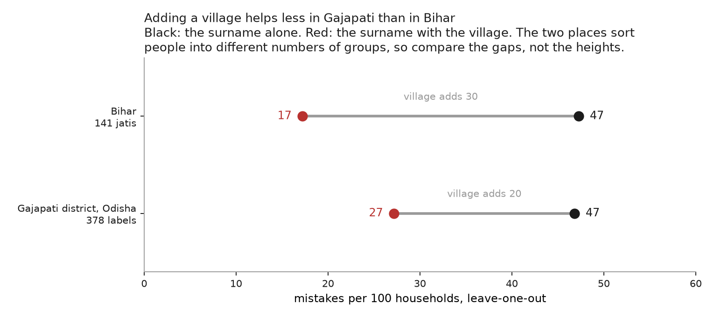

# Does the village premium travel outside Bihar?

Bihar's land records support the strongest single result in this repo. Across
141 jatis a surname alone leaves 47 mistakes per 100, and a
surname together with a village leaves 17. The question
that result raises is whether the 30-point difference describes
surnames and villages in general or describes Bihar.

The Odisha Record of Rights records a jati and a village for every tenant, which
makes the same measurement possible elsewhere. Scored on the same protocol, in
Gajapati district, **a village adds 20 points where in
Bihar it adds 30**. Relative to what the surname leaves
unresolved, the village closes 42% of the remainder here
against 64% in Bihar.

Put on analysis 02's axis, the two places produce the same shape and different
depths. Both leave the same number of mistakes once the place is discarded, and
they separate as it is restored.

## What is being compared, and what is not

The two levels are not comparable and the figure is drawn so as not to invite
the comparison. Bihar sorts people among 141 curated jatis; Gajapati
sorts them among 378 labels as recorded. A harder target produces more
mistakes whatever the surname does, so the quantity that carries across places
is the distance between the two rungs rather than the height of either.

Both places happen to leave 47 mistakes at the surname alone. Nothing follows
from that. The two are counting against different numbers of groups, so equal
heights there are not evidence that surnames are equally informative.

## Three choices that could have produced this result, and did not

A result assembled from a scraped record and a normalisation layer invites the
objection that the analyst's choices produced it. Three such choices were varied.

**How aggressively jati labels are merged.** Collapsing
378 labels to 218 moves the premium by
less than a mistake per hundred.

| similarity threshold | groups | surname | + village | premium |
|---|---|---|---|---|
| 92 | 378 | 46.8 | 27.2 | **19.7** |
| 85 | 317 | 46.4 | 26.9 | **19.5** |
| 78 | 264 | 46.2 | 26.4 | **19.8** |
| 72 | 218 | 45.9 | 25.8 | **20.2** |

**Whether religion is stripped from the label.** A jati recorded as `ପାଣ` and
one recorded as `ପାଣ ଖ୍ରୀଷ୍ଟିୟାନ` are two prediction targets unless the
religion is removed, and treating religion as a predictor is not something this
repo does. Removing it lowers the premium from 19.7 to
15.8, and leaves the conclusion unchanged. Both are reported
because the choice is substantive.

**Which token is taken as the surname.** 91%
of tenants share a token with the father or husband named beside them, and that
token is last 80% of the time and first
11%. The last token is therefore the surname
in Gajapati, which is the opposite of Maharashtra (analysis 04) and the
reason the test is run per state rather than assumed. Taking instead the last
token of the first person listed, which matters for the 13% of records naming
several people, moves the premium by 0.2.

## Limits

**This is one district of thirty, and it is not Odisha.** The scrape has reached
Gajapati and no further. It is small, heavily Adivasi, and on the Andhra
border; its castes are not the state's. Nothing here may be reported as an
Odisha result, and the comparison is between one Bihar and one district.

**Each village is a sample, not a census.** The fetch caps how many khatiyans it
takes per village and the cap has already changed mid-collection, so the
realised figure is measured rather than assumed: a median of
35 khatiyans per village across
1,351 villages, with a maximum of
80. Bihar's ladder is built from a
complete record. A sampled village is a weaker cue than a complete one, so the
premium measured here is biased **downward**, and the gap to Bihar is an upper
bound on the true difference rather than a point estimate of it.

**The normalisation layer under-merges.** It leaves `ସଉରା` and `ସୌରା` separate,
because a one-character difference in a four-character string falls below any
threshold safe for longer names. 435 label strings become
378, against Bihar's curated 141. The sensitivity table above
is the reason this is reported rather than solved: the residual does not move
the answer. A fuller layer is being built in `upnaam` and will replace this one.

---

*Odisha Record of Rights collected in
[pranaam](https://github.com/appeler/pranaam). Bihar rungs from analysis 02.*
