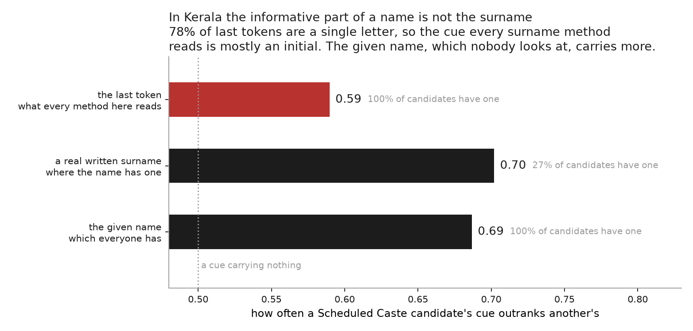

# Kerala, where the question often has no object

Everything else in this repo asks what a last name gives away about caste. In
Kerala that question frequently has nothing to land on.

**78% of last tokens are a single
letter.** None of the first tokens are. A name here is a given name followed by
initials standing for a father and a house: `KALPANA A`, `SHYLAJA E T`,
`SHAHUL HAMEED C K`. Only
32% of candidates have a written surname
at all, meaning a word after the given name that is not an initial.

So the honest thing is to measure the parts of a name that exist, and compare
them against the part every method in this repo reads.

| cue | who has one | distinct values | ranks a Dalit's higher |
|---|---|---|---|
| the last token | 100% | 10,210 | **0.59** |
| a written surname | 27% | 9,787 | **0.70** |
| the given name | 100% | 34,259 | **0.69** |

Take one Scheduled Caste candidate and one other at random and rank the pair by
a cue; the last column is how often the Scheduled Caste candidate ranks higher.
A cue carrying nothing gives 0.50.

**The last token, which is what a surname method reads, gives
0.59.** A written surname gives
0.70, and only a quarter of people have one. The
given name gives 0.69 and everybody has one.

In Kerala the informative part of a name is the part no surname-based method
looks at. That is a stronger version of what analyses 04 and 08 found in
Maharashtra and Karnataka. There the last-token rule read the wrong token. Here
it often reads a letter, because there is no other token to read.

## What is being predicted, and what was set aside

Community in these lists is a **reservation category the candidate declared**,
not caste as an observer would record it. The scored comparison is Scheduled
Caste against everyone else inside the caste categories: Scheduled Caste,
Scheduled Tribe, other backward classes, and forward. That is
866,812 candidates, 60% of the
file, of whom 19% are Scheduled Caste.

Set aside: the Muslim bucket at 16% and the Christian
bucket at 7%, because Kerala reserves for both and
scoring them would make religion a predictor, which this repo does not do.

Also set aside are the 17% with no
community, treated here as missing at random. **The label pattern says they are
not.** `MENON` and `NAMBOOTHIRI` appear zero times in the community column and
`NAIR` 794 times, because a forward caste has no reservation to claim, so the
blanks are disproportionately forward caste. Dropping them removes the most
distinctive non-Dalit names from the comparison, which pushes every figure above
*down*. Read them as a floor.

## Limits

- These are people who applied for and obtained state government jobs. Nothing
  here describes Kerala.
- The given name carries religion as well as caste even inside the Hindu
  categories, and this cannot separate the two. The given-name figure is not a
  clean caste signal.
- Analysis 07 puts Kerala at 0.85 from the census extract and the electoral
  rolls. That is a different population, a different target and a different set
  of names, and the two should not be read as one number moving.

---

*Kerala PSC select lists, collected in
[pranaam](https://github.com/appeler/pranaam).*
