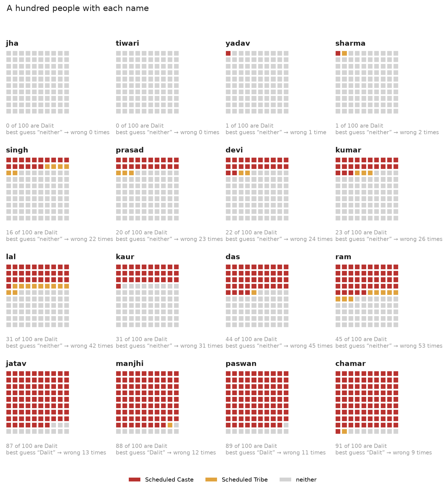
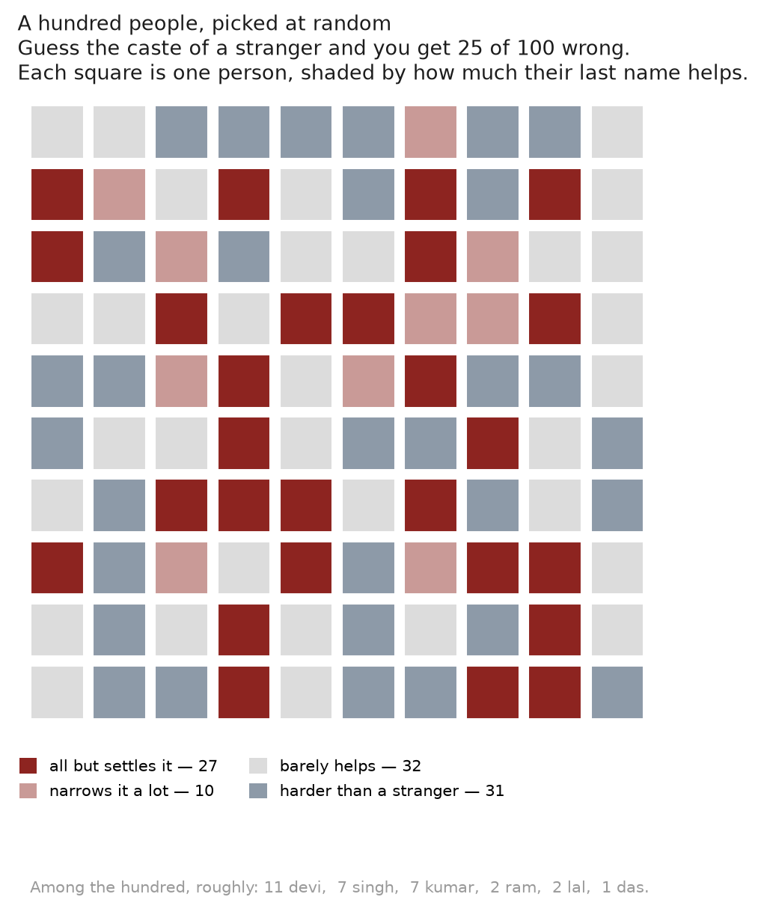
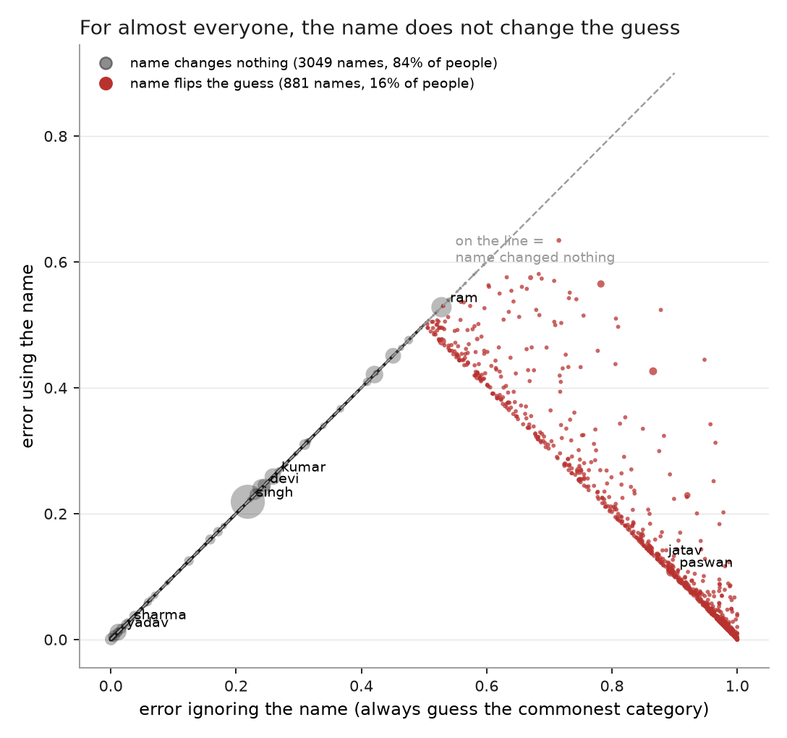
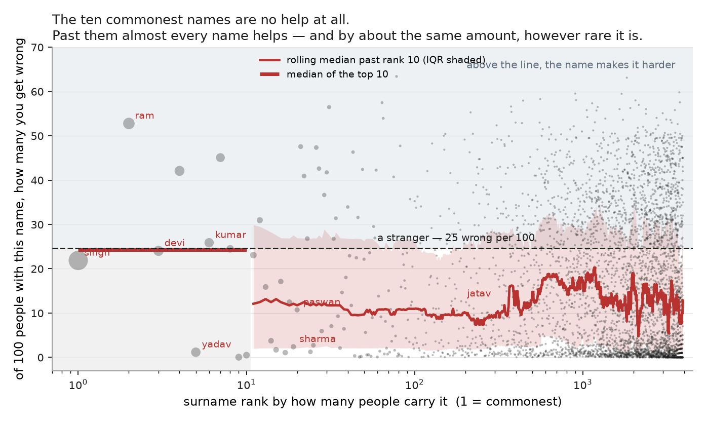
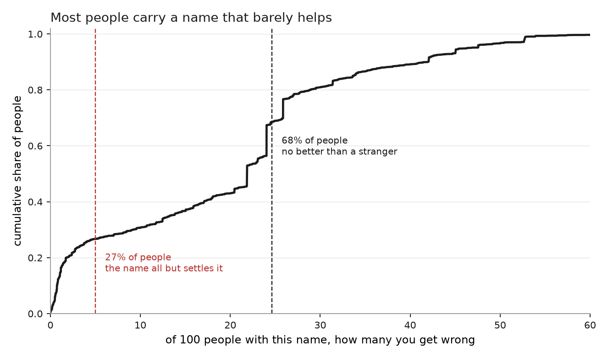

# On a last-name basis

### How much does an Indian surname tell you about caste?

*Draft. Every number here is generated by `scripts/build.py`; the tables are in
`out/tab`.*

You meet someone in a city big enough that you have no idea where their family
is from. All you have is a last name. How much does that narrow down their caste
— and if you had to guess, how often would you be wrong?

## Start with a room of a hundred people

Take a hundred adults at random. About 19 are Dalit (Scheduled Caste), about 6
are Adivasi (Scheduled Tribe), and about 75 are neither.

Now guess. You know nothing about anyone, so you say "neither" every time,
because that is the safest single answer. You are wrong 25 times out of a
hundred.

That is the number to beat.

## Now you get to hear the name

For some names this changes everything. For most it changes nothing at all.

Read a few of them:

- **Jha.** Fewer than 1 in 100 are Dalit. Say "neither" and you are all but
  certain to be right. This name has genuinely told you something.
- **Kumar.** 23 in 100. Say "neither" and you are wrong 26 times. You were wrong
  25 times before you heard the name. It has bought you almost nothing.
- **Ram.** 45 in 100 — very nearly a coin flip. Your best answer is still
  "neither", and now you are wrong 53 times, *worse* than the 25 you started
  with. The name has not misled you; it has correctly told you this is a hard
  case.
- **Paswan.** 89 in 100. Here, and only here, your answer actually changes: you
  now say "Dalit", and you are wrong 11 times.

## The catch: almost nobody is called Paswan

Here is the thing that decides the answer. Indian surnames are enormously
concentrated, and the enormous ones are the empty ones.

Devi, Singh and Kumar are the three commonest surnames in the country. Together
with a dozen others in the same position they are about a fifth of every surname
on India's electoral rolls — and every one of them sits within five
people-in-a-hundred of the rate for the population at large. Knowing someone is
called Kumar tells you very nearly what you already knew.

So the honest way to ask the question is not "pick a name" but "pick a person".
Pick one at random and you are far more likely to get a Devi than a Paswan.

Weighted that way — by who you would actually meet — 37% of people carry a
surname that lands within five points of the base rate, and 91% carry one that
does not change your best guess at all.

## Why the five-mistake improvement is misleading

Across everyone, hearing names takes you from 25 mistakes per hundred to 20.
Five saved. That sounds like a modest but real gain, and the trouble with it is
that it describes nobody.

It is an average over three quite different situations. A few names settle the
question outright — Jha, Tiwari, Yadav, Sharma cost you one or two mistakes in a
hundred. Most names do nothing: for 91% of people the name does not change the
word that comes out of your mouth, because you were going to say "neither" and
you still say "neither". And for 32% of people the name makes the guess *harder*
than it was for a stranger.

Average a large group at zero, a large group below zero, and a small group at
almost everything, and you get five. No individual encounter looks like five.

Every grey dot sitting on that diagonal is a name that left your answer exactly
where it already was. The big dots — the names carried by the most people — are
all on it.

## What names are good at, and what they are not

The improvement that does exist is lopsided, and the direction matters.

| | share of people | how many the guessing finds | when it does say so, how often right |
|---|---|---|---|
| Dalit | 19% | 22% | 72% |
| Adivasi | 6% | 44% | 85% |
| neither | 75% | 98% | 81% |

Names are good at ruling people **out**. Jha, Tiwari, Yadav, Sharma all put you
under two in a hundred. Ruling people **in** is much rarer: surnames find only
22% of Dalits, though when a name does point that way it is right 72% of the
time.

Put plainly: 78% of Dalits carry a surname that does not mark them. The mistake
this makes is nearly always in one direction — Dalit and Adivasi people read as
neither. The reverse barely happens.

## One number, and it is just a count

There is no need for anything fancier than the count we have been using all
along: **of a hundred people with this name, how many would you get wrong?**

A stranger — someone whose name you have not heard — costs you 25 mistakes per
hundred. So 25 is the number every name is competing against.

| name | mistakes per 100 | |
|---|---|---|
| Jha | 0 | settles it |
| Yadav | 1 | settles it |
| Sharma | 2 | settles it |
| Chamar | 9 | nearly settles it |
| Paswan | 11 | nearly settles it |
| Singh | 22 | no better than a stranger |
| Devi | 24 | no better than a stranger |
| Kumar | 26 | slightly worse than a stranger |
| Kaur | 31 | worse than a stranger |
| Lal | 42 | much worse |
| Ram | 53 | much worse |

Two things in that ladder are worth stopping on.

**Jha does more work than Paswan.** Paswan is the dramatic name: it is the one
that actually changes your answer, from "neither" to "Dalit". But 11 in 100
Paswans are not Dalit, so you still get 11 wrong. Jha costs you 0. Being
surprised by a name and being certain after hearing it are not the same thing,
and it is certainty the question asked about.

**Some names leave you worse off than knowing nothing.** Ram is very nearly an
even split, so hearing it costs you 53 mistakes against the 25 you were already
making. The name has not lied to you — it has correctly told you this is a hard
case. But it has not helped. That is not one odd name: 32% of people carry a
surname that leaves the guess harder than a stranger's.

And the shape behind that average is the whole story. The ten commonest names
are 33% of everyone, and they cost a median 24 mistakes — against 25 for a
stranger. They are, as a group, no help whatever. Past those ten almost every
name does help, and by roughly the same amount however rare it is: the median
from rank eleven down to rank three thousand is about 13 mistakes. The step
happens at rank ten, and the people are all on the wrong side of it.

## Is the name really about caste, or just about region?

A fair objection. Lumping the whole country together is a way of saying "you
don't know where they're from" — and a name that merely marks a region would
pick up that region's caste mix and look informative without being about caste
at all.

It does not hold up, and the check is in the same unit as everything else. Take
a hundred people:

| what you know about them | mistakes per 100 |
|---|---|
| nothing | 30 |
| only which state they are from | 30 |
| only their last name | 20 |
| both | 18 |

(This table counts each record in the census once, rather than weighting by how
common a name is on the rolls, so its baseline is 30 rather than the 25 used
elsewhere. The comparison between the rows is the point, not the level.)

Knowing someone's state and nothing else buys you nothing whatever — you still
say "neither" everywhere, and you are still wrong 30 times. The name does all
the work, and adding the state on top of it saves barely 2 more. Whatever the
name is telling you, it is not a map.

## What this does not cover

**There is no OBC here.** The source records three categories — Scheduled Caste,
Scheduled Tribe, and everyone else — and that third bucket is 75% of the data.
So everything above is about how legible *Dalit and Adivasi status* is. The line
between backward and forward castes, which is where a great deal of everyday
caste sorting actually happens, is invisible in this data. Yadav comes out at 1
in 100, which says "not Dalit" and says nothing whatever about the rest.

**Plenty of names are missing.** The table holds 3,930 surnames from 19 states.
Sood, Iyer, Balmiki and Agarwal are simply not in it. Matched against Delhi's
electoral roll it can speak to 56% of surnames on the page — and separately, 27%
of Delhi's electors are listed with a single name and no surname at all.

**The cautious data makes names look worse, not better.** The published table
drops any cell with fewer than 100 records, and rare cells are the sharp ones.
Raising that floor makes names *less* useful, not more — from 20 mistakes per
hundred at a floor of 100 to 21 at 1000 — so if anything these figures flatter
surnames rather than the reverse.

**This is a perfect guesser, not a person.** It is a floor on what is knowable
from a surname, not a ceiling on what someone can work out about you. A real
person in a real city also has your first name, your father's or husband's name,
your neighbourhood, your accent. Each of those is another draw. All this says is
that *the surname on its own*, for most of the people who have one, is a much
weaker signal than its reputation.

---

*Source: [outkast](https://github.com/appeler/outkast)'s disclosure-limited
extract of the Socio-Economic and Caste Census 2011 (77M household-head records,
adults, cells of at least 100). How common each name is comes from
[instate](https://github.com/appeler/instate)'s 2017 electoral-roll counts,
because SECC counts heads of household and so undercounts women's surnames
badly. Name–caste association drifts over time; do not read these numbers to the
decimal place.*
